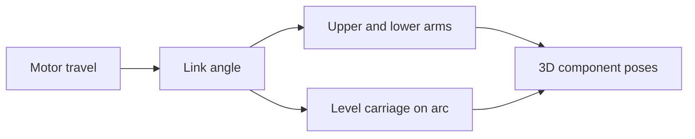

# Offseason bot CAD and deploy motion

The 2026-10-01 Onshape STEP exports replace the old placeholder geometry.
Source filenames and SHA-256 hashes are recorded in `cad-manifest.json`.
The original files remain in the supplied `offseason STEP` folder outside Git.
Swerve modules are fixed geometry in the base; their steering and wheels are not animated.

## Installed assets

| File | Geometry |
| --- | --- |
| `model.glb` | Fixed base, including chassis and static swerve modules |
| `model_0.glb` | Hood, green during SCORE/FEED |
| `model_1.glb` | Turret, green during SCORE/FEED |
| `model_2.glb` | Intake carriage and attached hardware, 52 instances |
| `model_3.glb` | Hood, yellow in other states |
| `model_4.glb` | Turret, blue in other states |
| `model_5.glb` | Upper deploy arms and attached washers, 6 instances |
| `model_6.glb` | Lower deploy arms and attached washers, 6 instances |

The seven indexed models match the pose array published at
`SuperstructureVisualization/Components`. The fixed base contains none of those
moving groups. Both hood/turret color variants share the same geometry; only one
variant of each is visible at a time when component poses are selected.

All assembled models are expressed in robot coordinates, in meters: X forward,
Y left, Z up. Onshape's assembly is rotated +90 degrees about Z. Its wheel contact
plane is already Z = 0. `config.json` therefore uses no overall rotation or
translation. Component `zeroedPosition` offsets align each rotating model's
pivot to the origin before the logged pose is applied.

The turret axis is **4.750 inches back, 8.025 inches left**, and its CAD reference
height is 14.750 inches. The hood hinge is recovered from the two pivot bearings,
approximately 4.160 inches forward and 3.272 inches above that turret reference.
The hood export is treated as the existing retracted-angle reference of 11 degrees.

## Rotary deploy implementation

The two intake exports have identical instance topology. Their assembly placements
separate into a level carriage, upper links, and lower links. Both link groups
rotate **88.4 degrees** about robot +Y. The carriage follows a circular arc while
remaining level; its full endpoint displacement is approximately **13.454 inches
forward and 8.016 inches down**.

`DeployKinematics` models these groups together, preserving their attachment
points throughout the motion. `MechanismVisualizer` publishes all three poses.



The deploy controller's existing calibrated inches represent motor/sprocket travel,
not straight-line intake displacement. Hardware ratios, operating targets, and
homing calibration are retained. The simulation bounds now cover both homing
endpoints, 0 to 11.9 inches, rather than clipping inward home to the 5-inch
operating minimum. A new `Deploy/LinkageAngleDegrees` log exposes the derived angle.

**Approximation:** link angle is proportional to the existing calibrated motor
travel between the two home positions. The geometry and end angle come from CAD;
the relationship between motor travel and intermediate link angle still needs
verification on the physical robot. The STOW target of 5 inches is an intermediate
angle, not the fully inward CAD pose.

## Regenerate

Create a Python 3.14 environment and install `tools/cad/requirements.txt`, then run:

```sh
python tools/cad/import_offseason.py '/path/to/offseason STEP'
```

The source folder needs `offseason-base.step`, `offseason-turret.step`,
`offseason-hood.step`, `offseason-intake-in.step`, `offseason-intake-out.step`,
and `offseason-full-reference.step`. Keep all exports in the TLA coordinate
system. The script preserves CAD colors for the base/intake, makes the state
color variants, separates the intake by endpoint motion, and records its derived
geometry. STEP conversion uses OCCT with 0.5 mm linear and 0.35 radian angular
tessellation deflection. Repeated geometry stays instanced in the final GLBs.

If regenerated CAD changes the pivots or linkage geometry, update the Java
constants to match the manifest and rerun the tests; regeneration does not
automatically change robot code.

## View and verify

In AdvantageScope, choose **Use Custom Assets Folder** and select this checkout's
`advantagescope_assets` parent folder. Select **581 Offseason Bot** in the 3D
Field view and add `SuperstructureVisualization/Components` as its component poses.
Reload assets if the previous placeholder model is cached. Color variants overlap
when no component poses are provided, because both variants use the same default
assembled position.

Validation covers the two exported endpoints, linkage attachment points at
intermediate positions, travel clamping, hood motion, component colors, and turret
placement. The final intake assets' outward transforms were also checked against
all 64 STEP-exported instance placements, with maximum matrix error below 1e-9.

References: [AdvantageScope component setup](https://docs.advantagescope.org/more-features/custom-assets/)
and [STEP conversion guide](https://docs.advantagescope.org/more-features/custom-assets/gltf-convert/).
