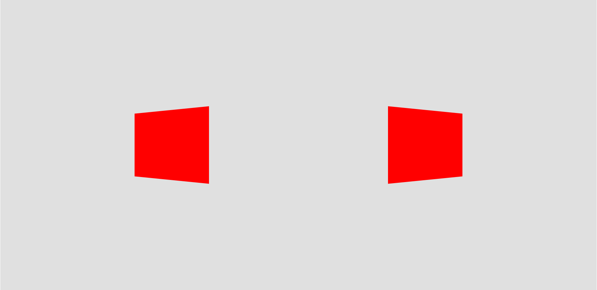

# 2026 REBUILT and Comp bot context

This is the durable starting point for agents working on Team 581's 2026
competition robot. It summarizes the game, useful strategy, the comp bot's physical
architecture, and the intent behind `comp-bot` software.

It is context, not a substitute for the current code, the official manual, logs,
or testing. It was last reviewed on August 30, 2026.

## Quick reference

### Game overview

- REBUILT is a 2-alliance game about collecting 5.91-inch foam FUEL, scoring it
  in an active HUB, crossing BUMPS or passing under TRENCHES, and optionally
  climbing the TOWER.
- AUTO lasts 20 seconds. Both HUBS are active. The alliance that scores more FUEL
  in AUTO has its HUB **inactive in Shift 1**; this is based on AUTO FUEL, not the
  total AUTO score.
- TELEOP begins with a 10-second transition in which both HUBS are active. Four
  25-second alliance shifts follow, with exactly one HUB active and the active
  alliance alternating each shift. Both HUBS are active again for the 30-second
  END GAME.
- Each FUEL scored in an active HUB is worth 1 point. FUEL entering an inactive
  HUB scores nothing. A robot may only launch FUEL into its HUB while its BUMPERS
  are at least partially in its ALLIANCE ZONE.
- A robot may control any number of FUEL. Most FUEL starts in the NEUTRAL ZONE,
  with additional FUEL in each DEPOT and OUTPOST and up to 8 preloaded per robot.
- BUMPS provide a wide but raised route between zones. TRENCHES provide a narrow,
  22.25-inch-high opening. Field assembly, FUEL distribution, wear, and carpet
  condition vary, so geometry and automation need margin.

### Comp bot overview

- The competition robot represented by `comp-bot` is a high-capacity,
  under-trench dumper with a full-width shooter. It has no climb subsystem.
- FUEL moves through the robot as follows:

  `wide ground intake -> hopper/floor conveyor -> feeder -> full-width drum shooter -> adjustable hood`

- The linked intake deploy and floor provide both intake geometry and hopper
  compaction. Changing deploy behavior can therefore change intake performance,
  storage, shooter throughput, trench safety, and jam behavior at the same time.
- Scoring means shooting into the HUB from the ALLIANCE ZONE. Feeding means
  launching FUEL from outside the ALLIANCE ZONE toward a selected collection
  location on our side, while avoiding the HUB and other field obstructions.
- `RobotManager` coordinates aiming, shooter/hood readiness, localization,
  movement limits, HUB timing, trench safety, hopper flow, and power allocation.
  A mechanism working alone does not mean the complete robot is allowed to fire.
- Three Limelight 4s support AprilTag localization. A forward-facing Limelight 3
  detects FUEL clusters for autonomous path selection.

### Source-of-truth order

When sources disagree, use this order:

1. Current `comp-bot` and `shared` code for current robot behavior.
2. The current [official 2026 REBUILT Game Manual][game-manual] for rules.
3. Team 581's [CAD and code release][release], current specification slides, and
   mentor-conference slides for design intent and mechanical context.
4. Chief Delphi and other community sources for strategic ideas only.

Do not treat `offseason-bot` as the comp bot. It contains a turret, kicker, tunnel,
and funneler architecture that is materially different from the full-width dumper.

## REBUILT game context

### Field and FUEL

The field is approximately 651.2 by 317.7 inches. Each end contains an ALLIANCE
ZONE, HUB, TOWER, DEPOT, and OUTPOST. The large central area is the NEUTRAL ZONE.
The HUB and the pairs of BUMPS and TRENCHES form the boundary between an ALLIANCE
ZONE and the NEUTRAL ZONE.

- The ALLIANCE ZONE is about 158.6 inches deep. G407 requires a robot's BUMPERS
  to be partially or fully in this zone before it launches FUEL into its HUB.
- A BUMP is 73 inches wide, 44.4 inches deep, and about 6.5 inches high, with
  15-degree HDPE ramps. Crossing at an angle or without momentum can beach a
  robot, especially when loose FUEL is involved.
- A TRENCH is 65.65 inches wide and 47 inches deep. The usable opening beneath
  its arm is only 50.34 inches wide and 22.25 inches high. The comp bot was designed to
  fit through it with the hood and deploy in safe positions.
- The HUB opening is about 72 inches above the carpet and processed FUEL exits
  back into the NEUTRAL ZONE. Code must not assume scored FUEL stays near the HUB
  or exits predictably.
- The OUTPOST lets human players put FUEL onto the field through its CHUTE, and
  lets robots push FUEL into the human-player CORRAL.

The manual stages 504 FUEL in a normal match: 24 in each DEPOT, 24 in each
OUTPOST CHUTE, up to 8 in each robot, and roughly 360-408 in the NEUTRAL ZONE.
The neutral-zone count may vary by about 24. Championship-level events may use
up to 600. FUEL also changes shape and grip as it wears. Intake, capacity, cluster
detection, shot consistency, and simulation should not assume ideal balls or a
perfect initial grid.

### Match timing and HUB activity

| Period | Match timer | Duration | HUB status |
| --- | ---: | ---: | --- |
| AUTO | 0:20-0:00 | 20 s | Both active |
| TRANSITION | 2:20-2:10 | 10 s | Both active |
| Shift 1 | 2:10-1:45 | 25 s | Lower AUTO-FUEL alliance active |
| Shift 2 | 1:45-1:20 | 25 s | Opposite of Shift 1 |
| Shift 3 | 1:20-0:55 | 25 s | Same as Shift 1 |
| Shift 4 | 0:55-0:30 | 25 s | Same as Shift 2 |
| END GAME | 0:30-0:00 | 30 s | Both active |

If AUTO FUEL is tied, FMS randomly chooses the shift order. FMS sends the alliance
whose HUB will be inactive first, and the robot must combine that value with match
time to infer the current state. The HUB lights give a 3-second deactivation
warning. Scoring assessment continues for 3 seconds after a HUB deactivates to
account for processing time.

This timing explains `HubActivity`: it tracks actual activity and a time-of-flight
adjusted activity state. The adjusted state allows the comp bot to begin a shot so that
FUEL arrives just after activation, and prevents starting a shot whose FUEL would
arrive after deactivation. Driver-station overrides exist because FMS data and
local match timers can be absent or wrong during testing.

### Points and ranking objectives

| Action | AUTO | TELEOP |
| --- | ---: | ---: |
| FUEL through an active HUB | 1 | 1 |
| LEVEL 1 TOWER | 15 | 10 |
| LEVEL 2 TOWER | - | 20 |
| LEVEL 3 TOWER | - | 30 |

In qualifications, the ENERGIZED, SUPERCHARGED, and TRAVERSAL ranking points add
strategic objectives. The final manual lists FUEL thresholds of 100/360 at normal
events, 240/360 at District Championships, and 360/500 at FIRST Championship;
TRAVERSAL requires 50 TOWER points. Always check the current manual and event
updates before using thresholds in code or match planning.

The comp bot has no climb mechanism, so it cannot contribute TOWER points directly.
Its relevant endgame contribution is usually FUEL scoring, feeding partners, or
defense compatible with the alliance's climb plan. The last 30 seconds also carry
TOWER protection: do not contact an opponent touching its TOWER.

### Rules that commonly affect strategy code

- G407 permits HUB shots only from the scoring alliance's ALLIANCE ZONE. This is
  why `RobotManager` automatically chooses scoring in-zone and feeding out-of-zone.
- G404 prohibits deliberately using FUEL to ease or amplify a field challenge,
  including launching it at opponents or placing it to impede TOWER access.
- G405 prohibits intentionally ejecting FUEL out of the field, except through the
  base of the OUTPOST.
- G408 prohibits strategically catching or redirecting FUEL directly as it exits
  the HUB before it contacts something else.
- G418 limits pins to 3 seconds and defines the separation needed to end a pin.
- G419 prohibits 2 or more robots from working together to isolate or close off a
  major element of gameplay. Normal independent collection near an opening is not
  automatically a violation.
- G420 protects an opponent contacting its TOWER during END GAME.

This is not a complete rules list. Any feature that changes field interaction,
defense, launch direction, robot extension, or endgame behavior requires a fresh
manual review.

## Strategy context

This section describes useful heuristics, not rules. Match strategy depends on
partners, opponents, human-player accuracy, FUEL distribution, damage, and score.

### The active/inactive rhythm

A simple default plan is:

- **AUTO and transition:** score available FUEL because both HUBS are active. AUTO
  FUEL also decides the shift order, so it affects when the alliance gets its two
  alternating active shifts.
- **Inactive shift:** acquire neutral FUEL, fill the comp bot, feed FUEL toward our
  alliance zone, screen for a partner, or disrupt the opponent without taking
  unnecessary penalties. Arrive staged and ready before activation.
- **Active shift:** convert staged inventory quickly. A high-capacity dumper is
  strongest when it starts the window full, reaches a protected shooting posture,
  and sustains throughput without large RPM drops.
- **Endgame:** both HUBS activate. Decide before the match whether the comp bot should
  keep scoring, feed, screen, or clear space for climbing partners.

Scoring more AUTO FUEL does not simply mean "winning AUTO": it deliberately gives
the alliance the second and fourth active shifts. That can be advantageous because
Shift 4 flows directly into END GAME, but the value depends on alliance capacity
and the match plan.

### Feeding and shuttling

In this repository, **feeding** is the comp bot launching FUEL across the field toward a
friendly collection pose rather than into the HUB. It is useful when the comp bot is
outside its legal scoring zone, during an inactive window, when a partner can
convert the FUEL faster, or when moving the whole robot would waste time.

The current implementation:

- Chooses the nearer left or right feed target based primarily on robot Y position.
- Switches to a backup target if the straight flight path intersects modeled
  obstructions.
- Uses separate feed distance-to-RPM, hood-angle, and time-of-flight maps.
- Compensates for robot motion and aims the swerve because the shooter is fixed to
  the chassis.
- Requires healthy localization, an aimed drivetrain, ready shooter and hood, a
  safe feed path, and a position outside the ALLIANCE ZONE before normal feeding.
- Falls back to a preset feed shot and alliance-relative heading if localization
  becomes unhealthy.

The modeled launch-path obstructions are visible below. These are generated from
`FieldUtil`; if the field model changes, regenerate and review the diagram rather
than manually editing the SVG.

The equivalent HUB-scoring obstruction view is useful when changing legal scoring
poses, hood safety, or shot selection.

Feeding has costs. Loose FUEL may be stolen, returned by an opponent, land where a
partner cannot collect it, or obstruct a route. A feed trajectory can also be
blocked by the HUB, BUMPS, TRENCHES, robots, or the field perimeter. Good alliance
planning assigns collection zones and prevents two partners from chasing the same
pile.

### Dumper strengths and weaknesses

Chief Delphi's [2026 robot-archetype discussion][robot-archetypes] describes wide
dumpers as high-throughput, high-burst scorers. That matches the comp bot's design:
capacity and full-width flow can turn a stored hopper into points quickly.

The corresponding weaknesses are important for software work:

- A fixed full-width shooter must rotate the drivetrain to aim. Defense can move
  the robot out of tolerance or block access to its preferred firing posture.
- Several FUEL can reach the shooter together, pulling down RPM and making the
  first row different from later rows.
- High simultaneous current demand from swerve, intake, feeder, conveyor, hood,
  and shooter can reduce performance or brown out the robot.
- Capacity increases mass and makes beaching, bump traversal, and escaping a
  defender harder.
- A large hopper is only useful when the intake and internal flow can fill and
  empty it reliably.

The community's [dumper starvation and defense discussion][dumper-defense]
suggests screening access routes, removing available FUEL, feeding away from an
opponent, and trapping a dumper near an obstacle. It also notes the counterplay:
a dumper can feed back, play defense, use a partner as a screen, or fill during
its inactive shift. Treat starvation as a match-specific tool, not a universal
strategy.

### Human players and the OUTPOST

Human players may throw FUEL directly toward the HUB or use the CHUTE to return it
to robots. The [community human-player discussion][human-player-strategy] frames
the decision as an opportunity-cost question: a capable human player can score in
parallel while robots collect elsewhere, but CHUTE loading can help an empty robot
at the right moment. Accuracy, cycle time, remaining loose FUEL, current HUB state,
and partner capability determine the best choice.

An alliance should decide who handles initial OUTPOST FUEL, whether feeds should
land near the OUTPOST, and how human-player activity changes between active and
inactive shifts. Do not hard-code one forum opinion as robot behavior.

## Comp bot mechanical context

The [Team 581 release][release] explains that the first competition robot was a
dye-rotor turret. After Silicon Valley, the team rebuilt around a dumper in 11
days, then iterated again for Championship. `comp-bot` represents that later
full-width dumper, while `offseason-bot` retains a different turret-derived design.

### Drivetrain and packaging

- Approximately 28.5 by 27-inch frame perimeter with chamfered module corners.
- Two WCP X2i and two X2c swerve modules, using Kraken X60 drive and X44 steer
  motors in the released robot.
- Low/custom module plates help cross the DEPOT and make room for a lower intake
  deploy position.
- The complete scoring package is short enough for the 22.25-inch TRENCH opening
  only when deploy and hood geometry are safe.

### Intake, hopper, conveyor, and feeder

- The full-width ground intake deploys linearly using a differential mechanism.
  The released design uses two X44s, gear racks, a 3-inch main roller, a 2-inch top
  roller, and two X60 roller motors.
- The detachable high-capacity hopper is integrated with the bumper volume and
  uses polycarbonate sides plus netting to retain FUEL.
- The floor/conveyor uses compliant, spring-tensioned rollers. It can pivot for
  access and compaction, and its lowered front roller reduces FUEL camming under
  the floor.
- Retracting the intake deploy mechanically raises/compacts the floor, pushing
  FUEL toward the feeder faster. This mechanical coupling is why `HopperManager`
  owns coordinated deploy, intake, conveyor, and feeder states.
- The feeder lifts rows into the shooter. Feeder current is also used as an early
  estimate of the load approaching the shooter.

### Shooter and hood

- The shooter is a full-width, 4-inch aluminum drum wrapped in high-grip material
  and powered by four X60s. Current code runs one velocity-controlled motor with
  three followers.
- An inertia wheel helps preserve RPM through dense rows of FUEL.
- Three lower rollers guide FUEL to the drum. The released design drives them with
  two X60s.
- The adjustable hood has about 35 degrees of mechanical travel. An X44 drives it
  through a high reduction, and two powered hood rollers help define exit speed
  and angle.
- A CANrange estimates hopper fill and a retroreflective tower sensor detects FUEL
  staged immediately below the flywheel.

Mechanical dimensions and motor descriptions above come from the release. Before
ordering parts or changing ratios, verify the current CAD and physical robot.

## Comp bot software context

### System ownership

`Robot` constructs the hardware and subsystem graph. `RobotManager` coordinates
whole-robot scoring/feeding states. `HopperManager` independently resolves intake,
eject, ball-fill, score, feed, compaction, and stow intent. Mechanism subsystems
own actuator control and measurements; `PowerManager` owns dynamic supply-current
allocation.

The high-level flow is:

1. Driver requests intake, scoring/feeding, idle, eject, or a fallback action.
2. Localization, health, HUB state, robot velocity, trench proximity, and field
   position are collected.
3. `RobotManager` selects scoring versus feeding and normal versus fallback mode.
4. Aim parameters select chassis angle, shooter distance, tolerance, and angular
   feedforward; shooter and hood maps convert distance into mechanism targets.
5. The manager waits for all applicable readiness and safety gates.
6. `HopperManager` starts FUEL flow and compaction while `PowerManager` assigns
   current for the active task.
7. DogLog records requested state, readiness gates, sensor health, mechanism data,
   field calculations, and transitions for later WPILOG analysis.

### Scoring versus feeding

The driver's primary shot request calls `prepareScoreOrFeedRequest()`:

- In the ALLIANCE ZONE, the manager prepares a HUB score.
- Outside the ALLIANCE ZONE, it prepares a feed.
- Crossing the zone boundary during TELEOP automatically swaps the prepared mode.
- Unhealthy localization selects fallback states instead of normal pose-based
  states.

Normal scoring requires, among other conditions, legal zone position, swerve aim,
safe motion, settled driver intent, low IMU acceleration, shooter speed, hood
position, trustworthy localization, time-of-flight-adjusted HUB activity, and
trench clearance. Normal feeding requires aim, safe motion, shooter and hood
readiness, healthy localization, and an unobstructed selected feed path.

These gates are intentionally distributed. A change to a subsystem's `atGoal`,
health status, latency, or pose can prevent the whole robot from firing even when
the mechanism appears ready.

### Shoot on the move

`AimParameterUtil` uses separate `ShootOnTheMove` calculators for scoring and
feeding. It predicts how robot translation affects the FUEL flight, aims at the
compensated goal, adjusts the angular tolerance based on goal distance, and adds
an angular-rate feedforward. The swerve controller decides whether to use the
moving or static solution based on driver commitment and mode.

Shot RPM, hood angle, and FUEL time of flight are separate tunable maps for scoring
and feeding. Optional regression models exist behind feature flags. Never change
one map in isolation without considering aiming, readiness tolerance, HUB timing,
and the other mechanism map.

### Dense-row compensation and ball filling

The full-width shooter sees rows rather than isolated FUEL. Feeder current estimates
how large a row is before it reaches the drum, and the shooter adds torque-current
feedforward to reduce the resulting RPM dip. At the start of a shot, the first row
may already be past the feeder; hopper-full state selects an initial feedforward
until current-based estimation becomes useful.

Ball filling stores roughly one extra row (about 8 FUEL in release testing) inside
the shooter tower without accidentally firing it. `HopperManager` starts filling
when the hopper CANrange indicates high capacity, then stops when the tower sensor
detects staged FUEL. The deploy must be fully extended. If CANrange data is absent
or disabled, intake duration is the fallback trigger. If the tower sensor is
already triggered, flow stops conservatively.

### Power management

`PowerManager` applies task-specific supply-current limits on a single-threaded
executor so CAN configuration does not block the main robot loop. Its modes cover
idle, first AUTO segment, intake priority, near/far scoring, late-match beast mode,
near/far feeding, and driver-requested turbo mode.

The intent is to preserve shooter throughput and avoid brownouts without using
one conservative limit for the entire match. A power change must be evaluated as
a system change: raising swerve allocation can reduce what is safely available to
the shooter, feeder, conveyor, hood, intake, or deploy.

### Vision, localization, and autonomous behavior

- Three static Limelight 4s provide AprilTag observations. Localization prefers
  HUB tags when visible and can fall back to other field tags.
- The ground Limelight 3 runs a custom FUEL-cluster pipeline. `ClusterMap`
  transforms detections into field clusters and estimates which cluster provides
  the best collection rate.
- Trailblazer follows pose-based segments composed from points, actions, and
  constraints. The competition autos can choose among three second-sweep lanes
  using the cluster map without changing how far they travel down the shared lane.
- Auto-unbeaching converts IMU pitch and roll into a tilt vector, temporarily
  drives opposite the uphill direction, and resumes the interrupted intake segment
  once level. It is limited to situations where beaching is expected so it does
  not fight ordinary bump traversal.
- Simulation is intentionally approximate rather than full FUEL physics. It is
  used to validate state sequencing, field geometry, visualization, logging, and
  fallback behavior. Physical shot and flow claims require robot tests and logs.

### Current control intent

The primary driver controller keeps the normal cycle compact:

| Control | Current intent |
| --- | --- |
| Left trigger | Intake while held |
| Right trigger | Prepare/execute score or feed while held; idle on release |
| Left bumper | Eject while held |
| Right bumper | Return robot manager to idle |
| Back | Zero gyro |

The operator controller contains homing, unjam, power, stow, and contingency
functions, including hood/deploy homing, differential-desync recovery, shooter
warmup, deploy stow, intake-priority power, turbo mode, and trench override. Read
`Robot.configureBindings()` before changing or documenting an exact binding; the
slides record intent and older layouts, while code records the current mapping.

### Fallbacks and safety behavior

- **Localization/cameras:** unhealthy tag localization switches scoring and
  feeding toward preset/fallback behavior. Camera health is surfaced to the driver
  station. Pit functionality deliberately relaxes localization requirements and
  uses a static mechanism setpoint for pit tests.
- **Feed path:** normal feeding selects alternate feed targets around modeled
  obstructions and refuses to feed through an unsafe path. With unhealthy
  localization, collision checking cannot be trusted and the preset fallback is
  used instead.
- **HUB state:** driver-station options can disable HUB-state enforcement or supply
  a default AUTO result when FMS timing is unavailable. The normal match path uses
  time-of-flight-adjusted activity.
- **CANrange:** invalid, weak, disabled, or stale hopper ranging falls back to
  intake elapsed time before tower filling.
- **Tower sensor:** a detected/forced-true tower sensor stops filling, preferring
  lost capacity over accidentally sending FUEL through an unready shooter.
- **TRENCH:** the hood normally stows near a trench and normal pose-based scoring
  will not begin there. An operator override exists for exceptional cases and
  transfers safety responsibility to the drive team. Fallback and pit paths do
  not all share the normal trench gate, so changes to them need a separate hood
  clearance audit.
- **Readiness:** if aim, speed, acceleration, shooter, hood, localization, or HUB
  timing leaves tolerance, the manager returns from an active shot to preparation
  when the cancel-in-progress feature is enabled.

### Deprecated and experimental features

The release and specification deck mark several features as deprecated after
driver testing showed no net benefit:

- Bump-crossing snap/assist
- Snake mode that aimed the intake along velocity
- Wall-intake snapping
- Automatic trench centering
- Earlier smart hood-idling and hopper-raise concepts
- Climb assist, because the final dumper has no climber

Some supporting code or disabled options may remain. Their presence does not mean
they should be re-enabled. Reintroducing one requires a current problem statement,
driver feedback, simulation or controlled testing, logs, and review of interactions
with newer behavior.

## Agent guidance

### Before changing the robot

1. Confirm the requested robot is `comp-bot`, not `offseason-bot`.
2. Trace the request from controller or auto intent through `RobotManager`,
   `HopperManager`, the mechanism state machines, `PowerManager`, and swerve.
3. Identify every readiness gate, fallback, feature flag, driver-station option,
   and health signal affected by the change.
4. Check field mirroring, alliance color, scoring-zone legality, trench geometry,
   feed-path obstruction, and HUB timing when field position is involved.
5. Preserve or improve DogLog coverage so a failed transition can be diagnosed
   from a WPILOG rather than guessed from video.
6. Exercise normal, fallback, unhealthy-sensor, and simulation paths. Use the
   repository's simulation and WPILOG-analysis skills where appropriate.
7. For shot, feed, current, or timing changes, require log-backed validation on
   the physical robot. Do not infer new tuning values from this document.

### Stable code entry points

- [`Robot.java`](../comp-bot/src/main/java/frc/robot/Robot.java): subsystem graph,
  hardware-independent wiring, and controller bindings.
- [`Hardware.java`](../comp-bot/src/main/java/frc/robot/Hardware.java): current
  motors, sensors, CAN buses, and practice/competition hardware selection.
- [`RobotManager.java`](../comp-bot/src/main/java/frc/robot/robot_manager/RobotManager.java):
  whole-robot scoring/feeding coordination and readiness gates.
- [`HopperManager.java`](../comp-bot/src/main/java/frc/robot/robot_manager/hopper_manager/HopperManager.java):
  intake, ball filling, FUEL flow, deploy coupling, and compaction.
- [`AimParameterUtil.java`](../comp-bot/src/main/java/frc/robot/util/AimParameterUtil.java):
  static and moving scoring/feed aim calculations.
- [`ShooterConfig.java`](../comp-bot/src/main/java/frc/robot/shooter/ShooterConfig.java)
  and [`ShooterHoodConfig.java`](../comp-bot/src/main/java/frc/robot/shooter_hood/ShooterHoodConfig.java):
  current shot maps, time-of-flight maps, limits, tolerances, and regression models.
- [`HubActivity.java`](../comp-bot/src/main/java/frc/robot/hub_activity/HubActivity.java):
  FMS/match-time interpretation and flight-time-aware activity.
- [`PowerManager.java`](../comp-bot/src/main/java/frc/robot/power_manager/PowerManager.java):
  task-specific current allocation.
- [`FieldUtil.java`](../shared/src/main/java/com/team581/util/FieldUtil.java) and
  [`FeedLocation.java`](../shared/src/main/java/com/team581/util/FeedLocation.java):
  alliance-aware field zones, obstacles, and feed targets.
- [`Autos.java`](../comp-bot/src/main/java/frc/robot/autos/Autos.java) and
  [`ClusterMap.java`](../comp-bot/src/main/java/frc/robot/cluster_map/ClusterMap.java):
  autonomous lifecycle and FUEL-cluster selection.

## Sources

### Authoritative rules

- [Official 2026 REBUILT Game Manual][game-manual]. Use the live English manual;
  archived translations may not include team updates.
- [FIRST 2026 Season Materials][season-materials], including Team Updates, field
  drawings, and official assets.

### Team 581 design and implementation context

- [581 Blazing Bulldogs 2026 CAD and Code Release][release]
- [BB581 2026 Comp Bot v2 Specs][spec-slides]
- [BB581 202608 Software Mentor Conference Slides][mentor-slides]
- [Public 2026 code release][public-code]

### Community strategy context

- [2026 robot archetypes][robot-archetypes]
- [Starving and Snaring the Big Dumper][dumper-defense]
- [Human Player Strategy][human-player-strategy]

[game-manual]: https://firstfrc.blob.core.windows.net/frc2026/Manual/HTML/2026GameManual.htm
[season-materials]: https://www.firstinspires.org/resources/library/frc/season-materials
[release]: https://www.chiefdelphi.com/t/581-blazing-bulldogs-2026-cad-and-code-release/521762
[spec-slides]: https://docs.google.com/presentation/d/1X8D8IdVXwuGBsWUSbPylRr3xYJMJMTiA9mRgZe4Ca5A/edit
[mentor-slides]: https://docs.google.com/presentation/d/11TKDIiTARmvb41IkLeiS9JKhXBNYiGepClnYI2nfPjc/edit
[public-code]: https://github.com/team581/frc-2026
[robot-archetypes]: https://www.chiefdelphi.com/t/2026-robot-archetypes/515333
[dumper-defense]: https://www.chiefdelphi.com/t/starving-and-snaring-the-big-dumper/517179
[human-player-strategy]: https://www.chiefdelphi.com/t/human-player-strategy/514223
