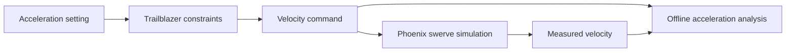

# Straight-line acceleration investigation — October 10, 2026

Trailblazer follows the configured acceleration during its normal rising ramp, but does **not**
enforce it throughout a straight-line move. Startup jumps immediately to 0.5 m/s, and braking
can drop the command faster than the configured limit. These are observable command violations
before any measured-acceleration filtering.

The default straight-line test passed. A six-setting sweep and four repeats also passed their
endpoint/settling checks. Those passes do not certify acceleration compliance. Production
Trailblazer and simulation physics were left unchanged; the headless test now records the actual
manager output alongside measured velocity in `drive-output.csv`.

Validation in the investigation worktree: `:offseason-bot:straightLineTest` passed all 16 focused tests.
The worktree's pending `:offseason-bot:driveRegressionTest` failed on its first leg with **25.167 m/s² commanded
acceleration against a 0.75 m/s² limit**; its remaining legs were blocked. That rejection occurs
before movement is commanded, so it does not depend on noisy measured acceleration. The pending
regression framework is separate work and is not included in this investigation commit; that
strict Gradle task requires the framework to be available.



## Normal settings

Sweep conditions: 6 m distance, 3 m/s speed limit, 12 V, zero initial heading and direction,
20 s timeout. The default baseline used 2 m, 1 m/s and 0.75 m/s².

| Configured acceleration (m/s²) | Median rising command acceleration (m/s²) | Measured rising-ramp fit (m/s²) | Largest command braking acceleration (m/s²) |
|---:|---:|---:|---:|
| 0.25 | 0.250 | 0.254 | 11.284 |
| 0.75 | 0.750 | 0.750 | 17.543 |
| 1.5 | 1.500 | 1.500 | 16.430 |
| 3 | 3.000 | 3.009 | 19.099 |

Every run started with a **0 → 0.5 m/s** command step. As a 20 ms loop change this is 25 m/s²;
the recording captures the actual startup step rather than assuming a precise startup interval.

The 0.75 repeat measured 0.751 m/s², and the 3 repeat measured 2.984 m/s². The 0.25 repeat had
a **732 ms output-loop stall**: the command increased only 0.010 m/s across that gap because
Trailblazer caps its integration interval at 40 ms. Its whole-ramp measured fit consequently fell
to 0.173 m/s², although the median rising command acceleration remained 0.250 m/s². This is a
timing limitation, so that repeat must not be described as an uninterrupted 0.25 m/s² ramp.

The measured fits exclude the first 250 ms after startup and the last 100 ms before the command
first plateaus or decreases. At least 250 ms of fit data is required. They describe the normal
ramp, not the whole move. Command braking peaks include real endpoint stops and abrupt corrections;
individual peaks can also be affected by asynchronous pose/timing changes.

## Why the violations occur

In [`ConstraintsCalculator.java`](../shared/src/main/java/com/team581/trailblazer/ConstraintsCalculator.java),
the reachable-speed calculation is `max(lastCommandedVelocity + acceleration * dt, 0.5)`.
That 0.5 m/s floor overrides low acceleration settings at startup, including immediately after
the follower resets from rest.

The calculator only bounds the increase in speed. It directly takes the smaller of the desired
speed, speed limit, reachable speed and `sqrt(2 * acceleration * distanceToEnd)`. There is no
matching bound on how quickly a command may decrease. The ideal stopping envelope usually
produces the expected slope, but a changed distance or PID demand can reduce the command abruptly.
[`Trailblazer.java`](../shared/src/main/java/com/team581/trailblazer/Trailblazer.java) also returns zero
immediately when the goal tolerance is reached, bypassing the constrainer.

## High settings and feasibility

| Setting (m/s²) | Median rising command acceleration (m/s²) | Command time to 2.9 m/s | Measured time to 2.9 m/s |
|---:|---:|---:|---:|
| 10 | 10.000 | 0.251 s | 0.301 s |
| 50 | 50.041 | 0.054 s | 0.285 s |
| 50 repeat | 50.080 | 0.065 s | 0.276 s |

Times start at the first nonzero command. The high-setting command ramp is too short for the
normal measured-ramp fit. No separate feasibility ceiling on the acceleration parameter appears
in this linear constraint path: 50 m/s² reaches the velocity command. The simulated drivetrain
responds much more slowly. Therefore measured failure to achieve 50 m/s² is not evidence that
Trailblazer silently clamps that parameter. The configured speed and stopping-distance bounds
still apply. Small command-slope discrepancies reflect sampling the manager output just after
the follower calculates its command.

## Noise analysis, after confirming normal-setting violations

Raw measured speed sometimes exhibits short dips and recoveries despite a smooth command.
For example, the 0.25 run dropped from 0.789 to 0.244 m/s in 21 ms, then recovered toward the
command. Its raw derivative peaked at 25.401 m/s². A 120 ms local linear fit of measured speed
reduced the peak to 5.926 m/s². For the 0.75 run the corresponding peaks were 17.078 and
6.034 m/s². This analysis was done only after verifying the startup command violation.

Windowing gives a more useful trend, but it also smooths real startup and stopping transients.
It cannot repair a command violation, establish the physical origin of a transient, or prove
compliance from a low filtered peak. The raw data remain intact. No filter was added to robot
measurements or control feedback. These speed-magnitude derivatives are appropriate for this
straight-line experiment; curved-path qualification requires vector acceleration.

## Reproduce and inspect

Run each setting serially and use a unique output folder:

```sh
./gradlew :offseason-bot:straightLineTest --tests frc.robot.sim.StraightLineSimTest \
  -Psim.distance=6 -Psim.maxVelocity=3 -Psim.maxAcceleration=0.75 -Psim.timeout=20 \
  -Psim.outputDir="$PWD/offseason-bot/build/reports/accelerationInvestigation/a0.75"
```

Repeat with `0.25`, `1.5`, `3`, `10`, and `50`. The CSV records the stopped baseline and actual
commands without invoking the follower a second time. Each measured velocity is sampled immediately
before its corresponding command is applied, so its response appears in later rows.

```sh
python3 tools/analyze_straight_line.py offseason-bot/build/reports/accelerationInvestigation
# Optional plots require matplotlib:
python3 tools/analyze_straight_line.py offseason-bot/build/reports/accelerationInvestigation --plot
```

The script writes `acceleration-summary.md` and `acceleration-metrics.json`; `--plot` also writes
`velocity-sweep.png` and `acceleration-noise.png`. Per-run raw CSVs, summaries and Gradle logs are
in that report directory. Build reports are local generated artifacts and are overwritten by
runs using the same folder.

The [captured run data](acceleration-investigation/acceleration-summary.md),
[velocity plots](acceleration-investigation/velocity-sweep.png),
[noise plots](acceleration-investigation/acceleration-noise.png), and
[strict startup result](acceleration-investigation/strict-startup.md) are saved with this report.
Recompute the captured metrics without running the simulator:

```sh
python3 tools/analyze_straight_line.py docs/acceleration-investigation
```

The next control change would be to remove or replace the startup floor and explicitly define
the desired braking/goal-stop behavior. These experiments do not implement that change.
