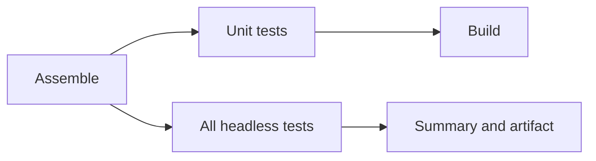

# Headless tests

Run all headless JUnit tests together:

```sh
./gradlew headlessTest
```

This works like the `test` command: Gradle discovers all JUnit tests in the headless source set,
produces a single suite report per project, and fails the task if any test fails. Currently the
offseason bot is the only project with a headless suite. The tests share one Gradle task and CI job;
they run serially with a fresh JVM per test class because HAL and Phoenix use process-wide resources.
No simulator GUI or physical robot is needed.

Keep using the focused command when working on the straight-line test:

```sh
./gradlew :offseason-bot:straightLineTest
./gradlew :offseason-bot:straightLineTest -Psim.distance=3 -Psim.maxVelocity=1.5
```

You can also select a class with JUnit's Gradle filtering:

```sh
./gradlew :offseason-bot:headlessTest --tests frc.robot.sim.StraightLineSimTest
```

Both commands use the same native libraries, isolation, defaults and `-Psim.*` overrides.
The normal `test`, `check`, `build`, and deployment tasks do not start the headless suite.

## CI

`.github/workflows/ci.yml` runs `./gradlew headlessTest` in the **Headless tests** job on every push.
The job collects Markdown motion summaries and uploads JUnit reports, motion data, and WPILOG files
in one **headless-results** artifact, including after a test failure. The existing Build job still
depends on Assemble and the unit-test job; it does not wait for the headless job.



## Outputs

For the offseason suite, outputs are under `offseason-bot/build/`:

| Path | Contents |
|---|---|
| `reports/tests/headlessTest/index.html` | Combined JUnit pass/fail report |
| `test-results/headlessTest/*.xml` | Machine-readable JUnit results |
| `reports/headlessTest/motion/summary.md` | Straight-line settings, result and measurements |
| `reports/headlessTest/motion/straight-line.csv` | Straight-line pose, velocity, acceleration and errors |
| `reports/headlessTest/motion/drive-output.csv` | Stopped baseline, actual manager commands and measured field-relative speeds at each output |

The focused command uses the same paths with `straightLineTest` in place of `headlessTest`.
Each invocation reruns the tests and overwrites its reports. Use `-Psim.outputDir=/absolute/path`
to save motion reports somewhere else. Ordinary WPILOG files are in `offseason-bot/logs/`.

The straight-line result checks reaching and settling at the endpoint; it does not certify
acceleration compliance. For the acceleration sweep, startup/braking violations, and analysis
instructions, see [acceleration investigation](acceleration-investigation.md).

## Add another headless test

1. Add a JUnit test class under `offseason-bot/src/simTest/java`. The suite discovers it without
   changing Gradle or CI. Use a separate class for each physical scenario to isolate native resources.
2. Reuse `HeadlessRunner` with a fixture and a state-machine routine. Hardware tests must still run
   through the Test-mode-only `TestManager`; headless discovery does not add a robot test selection.
3. If the test writes motion reports, use `System.getProperty("sim.outputDir")` and unique filenames
   such as `turn-summary.md` and `turn.csv` so it does not overwrite another test's output. CI collects
   every Markdown file in that motion directory and uploads the entire directory.

New tests will run in the same suite and appear in the same JUnit report and CI artifact. They do not
need a separate terminal task unless a focused shortcut is useful. Use the same `headlessTest` task
name if another robot project adds a headless source set; the root command and CI report globs will
include it.
