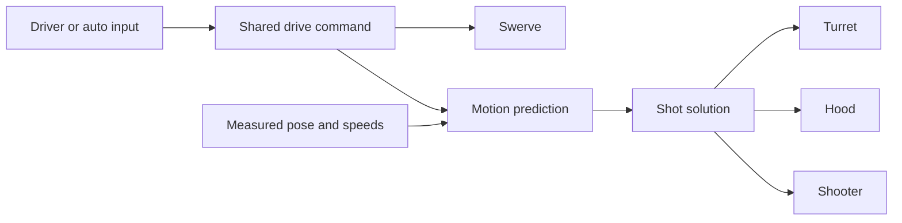

# Offseason shoot on the move

The drive command and shot solution now use the same loop's input. Scoring and feeding
anticipate a bounded drive response starting from measured motion, rather than waiting
for the drivebase to move or assuming that it follows the joystick perfectly.



## Try it in simulation

From the repository root:

```sh
./gradlew offseason-bot:simulateJava
```

Assign Xbox controllers to Driver Station ports **0** (driver) and **1** (operator).
Enable **Teleop**. Press the operator's **Back** button once to home the hood.
Hold the driver's **right trigger** to prepare and automatically score or feed.
Use the left stick to translate and the right stick to rotate. The usual localization,
trench, hub activity, and actuator readiness checks still decide when fuel can feed.

Try starting, stopping, reversing, and rotating while holding the trigger. The turret,
hood, and shooter should begin adjusting when input changes. Feeding is selected
outside the alliance zone.

The desktop regression test boots the actual Robot, uses simulated Phoenix motors,
injects joystick inputs, and checks the first-loop turret, hood, and shooter commands:

```sh
./gradlew offseason-bot:test --tests frc.robot.ShotCoordinatorSimulationTest
./gradlew offseason-bot:test shared:test
```

## How it works

Inputs run in ascending subsystem priority: drive and mechanism measurements, vision,
localization, then managers. Actions run in descending priority: auto input, RobotManager's
shot calculation, other managers, then the actuators. Both orders are stable for ties.

RobotManager freezes a field-relative drive command after the auto action. The snapshot
includes joystick shaping, alliance perspective, deadbands, and bump-assist yaw. The
drivebase consumes that same snapshot. Prediction converts any center-of-rotation
request into velocity at the chassis center for aiming.

Prediction integrates a first-order response in 5 ms steps with limits of **5 m/s²**
translation and **20 rad/s²** yaw. Response time constants are **150 ms** translation
and **100 ms** yaw. Every loop starts from the latest measured state, so prediction does
not accumulate error. The existing shot tables and time-of-flight compensation use the
predicted release pose and velocity, including motion at the offset turret axis.

The predicted shot direction is converted back into the current chassis frame before
commanding the turret. This avoids adding future chassis yaw to the turret angle. Velocity
feedforward differentiates the field shot direction over 20 ms, handles angle wrapping,
and subtracts measured chassis yaw once. Shooter
RPM and hood angle use the same solution's distance in the current loop. Readiness
checks also evaluate the updated goals. The old 300 ms SOTM activation delay is removed.

## Inspect and tune

The default `ShotCoordinator/LookaheadSeconds` is **0.10 seconds**, bounded to 0–0.25 s.
It is available through the existing DogLog tunable mechanism. Observe these log keys:

- `Swerve/MotionCommandFieldRelative` and `Swerve/FieldRelativeSpeeds`
- `ShotCoordinator/Scoring/TurretAngle`, `Distance`, and `TurretVelocity`
- `Turret/Setpoint` and `Turret/Angle`
- `Shooter/GoalShootingRPM` and `ShooterHood/GoalAngle`

The response model is a starting point for simulation and needs measurement on the
physical drivebase. The simulation test verifies command timing and native integration;
it does not establish real-world shot accuracy. Camera-loss scoring retains its static
fallback solution.

Design reference: [Slack thread](https://frc581.slack.com/archives/C05HRJ9L4E8/p1790102042988059).
The turret request uses Phoenix's position and velocity setpoints, documented in
[PositionVoltage](https://api.ctr-electronics.com/phoenix6/stable/java/com/ctre/phoenix6/controls/PositionVoltage.html).

## Circle-feeding regression

The native simulation also holds the driver trigger while driving one full circle at
approximately 1 m/s and rotating at 2.8 rad/s. It checks FEED state and the actual feeder
state on every loop, and separately checks turret, flywheel, and hood errors against
existing tolerances. It verifies the robot actually travels around the circle and turns
more than 360 degrees.

Feed readiness checks the current shot rather than rejecting large future aiming-angle
changes. Actual unwrap movements and out-of-tolerance aim still stop feeding. Feed target
selection checks clearance around the turret's swept footprint, reserves 35 cm for drive
response, and checks the predicted position. A clear backup target stays selected during
that feeding request to avoid abrupt switches near a hub obstruction.

Observe `ShotCoordinator/Feeding/Target`, `TurretError`, and `TurretTolerance` alongside
`RobotManager/Feeding/IsInSafeFeedingLocation` to diagnose interruptions. Mechanical turret
travel limits still apply; the regression starts on a branch with room for its full turn.
