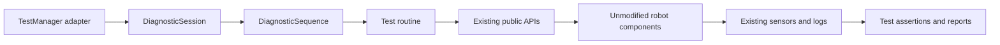

# Whole-robot regression test design

This design targets `offseason-bot` and the shared Trailblazer library. The goal is a repeatable
answer to **can this build drive, acquire fuel, score, feed, recover from faults, and stop safely?**
Run the same scenarios and acceptance rules in desktop simulation and on the robot. Simulation
validates the software and its modeled behavior; a physical run validates the actual mechanisms,
localization, and shots. Record both results separately.

**Status:** the reusable testing lifecycle, bounded sequence runner, strict flat-floor drive
regression, angular settling check, counted-fuel evaluator and report writer are implemented.
The full 37-scenario suite remains a design specification. New numeric limits are starting acceptance
targets; current mechanism configuration values are identified separately. Do not loosen a limit
automatically because a new build fails it.

**Architecture constraint:** changes to test management/architecture are allowed. Keep that code in
`frc.robot.testing` and test fixtures; do not refactor robot managers, mechanisms, localization,
production Trailblazer or their simulation behavior to enable tests. Existing `Robot` wiring and
public APIs stay unchanged. The current Test-mode adapter is already in the deployed robot and can
be extended without making production managers implement test interfaces or share diagnostic state.
Broader scoring/whole-robot orchestration still needs a separate fixture/entrypoint because the
existing adapter's preparation callback intentionally idles the normal managers.

## Existing foundation and gaps

| Existing code | What can be reused / what is missing |
|---|---|
| `testing/TestManager` | Test-mode selection, configuration snapshot on enable, abort and stopped output. Selects `NONE`, `STRAIGHT_LINE` or strict `DRIVE_REGRESSION`; delegates its lifecycle to `DiagnosticSession`. |
| `testing/StraightLineRoutine` | Measures pose, speed, acceleration and cross-track error. Pass checks endpoint, heading, stopped translation and rotation, settle time and timeout. Legacy straight-line mode still records speed/acceleration; strict regression enforces them through `MotionAssertions`. |
| `sim/HeadlessRunner`, `sim/SwerveFixture` | Headless JUnit loop and actual Phoenix swerve simulation using robot constants. Fixture bypasses the full robot managers, bindings and localization stack. |
| `Robot` / production Trailblazer | Production follower includes `BumpCrossingFollower`. `TestManager` constructs a separate plain PID follower, so the current test cannot certify the production wrapper. |
| `autos/TestAuto`, `autos/IntegrationTest` | Useful scenario sketches, but no complete measurement-based verdict. They are not selections in offseason `AutoSelection`; offseason `Robot` now registers `Autos` with the comp-bot routines. |
| Deploy, turret, hood and shooter | Have `simulationPeriodic` support. This does not establish working fuel transport or scored-ball physics. |
| `HopperManager`, `HealthManager` | Simulation contains timed fuel/fullness substitutes and always-healthy camera shortcuts. Leave them unchanged. Cases these shortcuts prevent must be reported as sim coverage gaps, with hardware or existing-input tests used where possible. |
| `Hardware` cameras | The left, right and ground Limelights currently use placeholder names/configuration; the turret camera has been removed. Real localization/scoring qualification requires actual camera identities and transforms. |
| Shooter readiness | Currently derives readiness from the top-right motor. Regression observations must independently check all four motors, including follower ratios and direction. |
| Funneler | Wired into `HopperManager` to follow conveyor transport requests. Control-flow tests cover intake, shooting and ball filling; verify physical transport participation separately. |

A baseline run on October 10, 2026 passed all 14 existing focused tests. Its Phoenix motion report
recorded 1.000 m/s peak speed, 0.087 m final error, and **13.496 m/s² raw peak acceleration** with
`maxAcceleration=0.75`. This is not proof of meeting the acceleration constraint: velocity sampling
has timing noise, and `ConstraintsCalculator` also permits a minimum initial reachable speed of
0.5 m/s. The new checks must expose startup behavior, rather than exclude startup from measurement.

## Suite structure

Use a state machine for each scenario. Each has an ID, initial conditions, production requests,
observed signals, explicit assertions, deadline, cleanup, and required environment capabilities.


Any disable, mode change, fault, or deadline transitions to cleanup; never advance an unsuccessful
step as if it passed. Independent tests may continue after an ordinary failure once cleanup is
verified. A safety failure ends the run. A dependent test is blocked if its prerequisite failed.

| Profile (proposed) | Purpose | Required scenarios |
|---|---|---|
| `PIT` | Stationary bringup, no fuel launch or floor driving | S01–S03, M01–M04, unloaded M06, C01–C02. Moving checks require a restrained setup; pit passes do not certify field operation. |
| `FIELD_QUICK` | Check after a software change; target about 10 minutes including resets | S01–S03, D01–D03, D05, D08, M01–M07, Q01–Q02, Q05, C01, P01. Five-shot samples at each static scoring location. |
| `FIELD_FULL` | Qualification before competition or major changes | All applicable scenarios below, both alliances, nominal and reduced-voltage runs, 20-shot scoring samples. |
| `SIM_FULL` | CI on every change | Same full scenario definitions through test-owned physics/sensor adapters using existing APIs, plus supported fault injections. Report capabilities that are unavailable. |

`PIT`, `FIELD_QUICK`, `FIELD_FULL` and `SIM_FULL` are proposed names, not current chooser options.
Every currently configured subsystem/state family appears below. There is no active climber in
offseason `Hardware`; D09 tests drive alignment only. Add a coverage entry before introducing any
new mechanism, state, auto, binding, feature flag or fallback path.

## Separate testing architecture



Implemented test-owned pieces:

| Piece | Responsibility |
|---|---|
| `DiagnosticRoutine` | Test-only tick/stop/abort/output protocol and RUNNING/PASSED/FAILED/ABORTED/BLOCKED results. Production managers do not implement it. |
| `DiagnosticSession` | One factory/configuration snapshot per enable, Test-mode lifetime, terminal latching, exception results and zero drive output on stop/failure. |
| `DiagnosticSequence` | Named, bounded steps; lazy construction; stopped output between steps; failure blocks dependent steps; retained per-step evidence. |
| `StraightLineDiagnostic` | Wraps the existing test routine and a dedicated test controller. Strict mode checks startup, velocity, vector acceleration and motion sample gaps without modifying follower outputs. |
| `MotionAssertions` | Independent commanded limits and measured 100 ms vector-acceleration window, including startup; rejects nonfinite input and non-increasing timestamps. |
| `FuelOutcome` | Counts-based hit evaluation and inventory reconciliation. Does not trigger scoring or substitute manager readiness for actual hits. |
| `DiagnosticReport` | Unique-run Markdown reports; blocked/empty evidence cannot pass; existing reports cannot be overwritten. |

`TestManager` retains its existing constructor/API for the normal `Robot` and the sim fixture.
`getRoutine()` still exposes legacy straight-line samples; generic callers use
`getActiveDiagnostic()` and `getResults()`. Its controller has separate state from autonomous and
uses diagnostic-owned gains. The existing idle preparation callback is unchanged. No production
class has been refactored or given a test interface/provider.

The current `DRIVE_REGRESSION` uses the same strict four-leg routine on hardware and Phoenix sim.
The ordinary headless suite verifies the framework and failure paths. The separate
`driveRegressionTest` task is qualification: it requires an actual PASSED diagnostic result and
returns nonzero when the robot fails the criteria. It is opt-in while the existing startup jump is
unresolved; the normal tests do not encode that production defect as expected behavior.

For the remaining whole-robot suite, use a separate test fixture/entrypoint that constructs existing
production components through their public constructors. Keep new orchestration out of normal
`Robot` and do not construct both robot graphs at once: CAN devices must have a single owner.
A separate diagnostic artifact/source set remains an option for those broader routines, not a
requirement to leave the existing testing architecture unchanged.

There are two kinds of evidence, reported separately:

| Runner | What it proves |
|---|---|
| Component/integration fixture | Exercises unchanged production classes through their existing APIs; declares its test-owned composition. |
| Normal robot acceptance run | Exercises actual `Robot` wiring, bindings and lifecycle through driver inputs and existing telemetry. |

A fixture that constructs `Autos` cannot certify it is wired into the normal robot; a fixture with
working cameras cannot certify `Hardware` placeholders. Full qualification needs normal-robot evidence.

Contracts for the remaining implementation:

- Inject clocks, request/observation adapters and outcome observers into test code only. Use existing
  vendor sim APIs, DS/joystick inputs, NetworkTables and public sensors where production consumes them.
  If an input is inaccessible, report the assertion blocked; do not add hooks or use reflection.
- Add full-profile selection in test code with default NONE; snapshot configuration/options per
  enable. Keep normal-robot acceptance separate from fixture orchestration.
- Instantiate unchanged Trailblazer follower/tracker classes and bump wrapper in applicable fixtures,
  using existing constants. Declare the composition; do not extract a production factory for tests.
  Current plain-follower drive regression does not certify bump-wrapper behavior.
- Verify actual scheduler ordering and one-loop request propagation through existing observations or
  test-owned probes. `SubsystemExecutionSequencer` iterates a priority queue; priority numbers alone
  are not proof of execution order. Report failures rather than fixing the scheduler for testing.
- Leave `HopperManager` timed fuel substitutes and `HealthManager` sim health shortcuts untouched.
  Model fuel/outcomes independently, but mark production checks blocked if shortcuts override injected
  input. Tests of a test-owned model certify that model only; never force manager states or readiness.
- Use public requests for fixture cleanup, then disable/neutralize owned hardware if needed.
  `robotManager.idleRequest()` alone may spin the shooter or fill the tower. Record production
  cancellation behavior before harness cleanup so the harness cannot hide a lifecycle defect.
- Exercise teleop/autonomous semantics with those actual DS modes in separate fixtures. Test mode
  cannot certify zone transitions, button bindings or hub timing alone.
- Isolate HAL/Phoenix classes in fresh JVMs as current `headlessTest` does. Close test-owned resources
  using existing APIs; use process isolation where production resources expose no shutdown method.

## Trailblazer acceptance rules

Measure field-relative `vx`, `vy` and `omega`, together with their actual sensor timestamps. Record
requested speeds, fused pose, independent truth, active point index, segment ID and constraints.
Use wrapped heading error for the drivetrain and physical multi-turn limits for the turret.

| Measurement | Proposed starting limit |
|---|---|
| Default flat-floor command | 1.0 m/s translation; 0.75 m/s² acceleration and deceleration; 90°/s and 90°/s² angular limits |
| Commanded translation/rotation speed | At or below configured limit, numerical allowance 0.01 m/s / 1°/s |
| Commanded acceleration | At or below configured limit + 0.05 m/s² / 5°/s², including startup, turns, waypoint changes and normal stopping |
| Measured translation speed | At or below configured limit + max(0.10 m/s, 10% of limit) |
| Measured translation acceleration | At or below configured limit + max(0.20 m/s², 20% of limit), using the timestamped 100 ms window below |
| Measured angular speed / acceleration | At or below configured limit + 10°/s / 20°/s² |
| Final translation / heading error | ≤ 0.10 m / 3°; measured independently as well as using the robot estimate |
| Maximum cross-track / translating heading error | ≤ 0.20 m / 5° on constant-heading straight segments |
| Curves and multi-point routes | ≤ 0.20 m distance to the intended current geometric leg/arc; no corner shortcut outside its corridor |
| Settling | Translation ≤ 0.10 m/s and rotation ≤ 5°/s, with both pose errors in tolerance continuously for 0.25 s |
| Deliberate straight-line cruise | ≥ 90% of requested cruise speed for at least 0.30 s on a route long enough to cruise |
| Completion / data | Each 2 m flat or 90° turn scenario ≤ 10 s; multi-point scenario ≤ 20 s; no nonfinite input, reversal of timestamps or required sensor age > 100 ms |

Compute speed as `hypot(vx, vy)`. Compute **vector acceleration**, not the derivative of speed alone:

```text
command_accel = hypot(vx_command[i] - vx_command[i-1],
                      vy_command[i] - vy_command[i-1]) / command_dt
measured_accel = hypot(vx[t] - vx[t-0.10], vy[t] - vy[t-0.10]) / 0.10
angular_accel = abs(omega[t] - omega[t-0.10]) / 0.10
```

Interpolate the 100 ms window endpoints from fresh timestamped samples; apply the same window in
both environments. Before the first 100 ms, use the available interval from the timestamped initial
sample; startup still counts. Require each complete window to meet the limit; report raw adjacent
sample peaks too. This window reduces vendor sampling noise but does not certify impulse peaks.
Where those peaks matter, use timestamped higher-rate odometry/IMU data and a calibrated threshold.
Do not differentiate discontinuous vision pose corrections to estimate drivetrain acceleration.

On a 2 m straight route, `v²/a = 1.33 m` at the default constraints, leaving room to test cruise.
Use distance/constraint-aware deadlines for other settings, fixed before starting. A lower speed
cannot pass solely by eventually arriving. Initial measured motion must be ≤ stopped thresholds.

For independent truth, use fixture physics pose in sim and surveyed floor marks plus video/tag
ground truth on hardware. Odometer scale or gyro sign errors can otherwise make the estimator and
follower agree while the real robot goes to the wrong place. If independent truth is unavailable,
label the physical accuracy result `BLOCKED`, while retaining controller-only measurements.

Bump overrides currently request a field-X speed of 4 m/s. Test these with a separately named bump
envelope and cleared route; retain both the configured and overridden limits in the report. A flat
1 m/s constraint test must fail if this override activates unexpectedly. Never grant an unlimited
acceleration exception to a bump test; establish its explicit limits from physical baseline runs.
Emergency abort stops are separately assessed for safe stopping, outside normal trajectory limits.

## Scenario catalog

`Both` means required in sim and on hardware. `Injected` means automated simulated fault coverage;
hardware uses a controlled, non-destructive equivalent when possible. Every row includes a bounded
deadline; lack of equipment or observability produces `BLOCKED`, never `PASS`.

### Lifecycle and drive

| ID | Setup and action | Required evidence / verdict | Environment |
|---|---|---|---|
| S01 | Boot disabled; choose NONE; exercise buttons and chooser | No powered actuation while disabled; correct build/robot kind; finite and fresh required inputs; changing selection cannot start a run | Both |
| S02 | Disable during drive, homing, intake, spin-up and scoring; then enable teleop and Test separately | Diagnostic outputs cleared by next 20 ms loop; normal powered actuation ceases; coast-down measured separately; no resumed shot/path; Test restart requires a new enable | Both |
| S03 | Change configuration/selection during a run; then interrupt or exceed deadline | Original snapshot retained; aborted/failed result with reason; cleanup within one loop; no automatic retry or success from timeout | Both |
| D01 | From surveyed start, drive 2 m forward, reverse, left and right; repeat at 0°, 90°, 180° starting heading | All Trailblazer limits above, correct directions, cruise check and endpoint settle; return legs are separate measured scenarios | Both |
| D02 | Turn ±90° in place; cross +179°/−179° heading boundary | Angular limits, translation drift ≤ 0.10 m, correct shortest heading path and settled endpoint; ≤ 10 s each | Both |
| D03 | Traverse a cleared multi-waypoint rectangle and an explicit arc, with translation plus rotation | Correct point order; each transition meets its declared tolerance; path corridor respected; continuous command limits; no skipped point or premature completion; ≤ 20 s | Both |
| D04 | Repeat a route with segment and per-point velocity/acceleration overrides | Correct effective constraint at each point; tighter overrides enforced; segment restart resets controller history; ≤ 20 s | Both |
| D05 | Repeat field-authored routes for red and blue; repeat robot-relative diagnostics | Field route mirrors correctly; robot-relative diagnostic displacement stays relative to starting heading, independent of alliance; same accuracy limits | Both |
| D06 | Start at position tolerance ±0.01 m and heading tolerance ±0.5°; enter/leave goal while still moving | Completion only inside all tolerances and after full settle window; wrong heading cannot pass; endpoint movement resets settle timer; ≤ 10 s | Both |
| D07 | Apply small lateral disturbance; inject frozen pose, stale speed and nonfinite input in separate runs | Recover to corridor within 2 s for benign disturbance; fault or deadline for invalid/frozen sensors; clear segment/output; no false pass | Injected; gentle hardware displacement separately |
| D08 | Teleop field-relative drive, rotate chassis, zero gyro, release sticks; test bump assist on/off and dynamic center of rotation | Correct driver perspective on each alliance; deadband produces zero request; heading reset is reflected; assists activate only in intended region; ≤ 15 s each | Both; obstacle contact hardware |
| D09 | Request climb alignment at its documented target through the existing public Swerve API | Trailblazer aligns and settles; manual control returns after cancel; ≤ 10 s. This covers alignment, not a climbing mechanism | Both fixture; normal-robot input coverage blocked if no binding exists |
| D10 | Traverse approved bump/trench; inject uphill/downhill/flat IMU states in sim | Correct override direction for alliance, preserved Y/heading, bounded bump envelope, flat behavior restored within one loop; hood protected near trench; ≤ 15 s | Both; physical bump qualification required |

### Mechanisms and fuel handling

| ID | Setup and action | Required evidence / verdict | Environment |
|---|---|---|---|
| M01 | Home deploy inward/outward and hood; initialize turret from absolute encoder; repeat from cold boot | Valid reference reached ≤ 5 s per homing action; unhomed mechanism cannot report ready; reference repeatable; startup absolute/motor angle consistent within 3° | Both |
| M02 | Deploy intake, stow, safe kicker stow, score/feed compaction and approved desync recovery | Both sides within `DeployConfig.POSITION_TOLERANCE` (currently 0.25 inches) and side mismatch ≤ 0.25 inches for 0.25 s; ≤ 3 s each; physical limits respected | Both |
| M03 | Hood at idle/score/feed targets and bounded out-of-range requests | Current scoring tolerance 3°, feeding 5° continuously 0.25 s; ≤ 2 s; setpoint clamped to configured range; no false ready before homing | Both |
| M04 | Turret static aim, moving aim, unwrap across boundary, stuck/faux-dumper behavior | Within production distance-dependent aim tolerance for 0.25 s; ≤ 2 s static; correct feedforward; physical multi-turn limits respected without driving into stops | Both |
| M05 | Spin shooter at near/middle/far scoring and feeding setpoints, then shoot a burst | Top-right meets current 50 RPM prepare, 300 RPM active-score, 500 RPM feed tolerances; independently verify all motors against intended ratios within 5%; spin-up ≤ 3 s; recover after shot ≤ 1 s; never exceed 6000 RPM | Both |
| M06 | Pulse intake left/right, conveyor top/bottom, feeder top/bottom and funneler; idle and relevant reverse states | Every motor moves with configured surface direction within 1 s; stable unloaded speed within ±15% of known-good value; idle command and coast-down distinguished; followers cannot pass because leader works | Both; surface direction confirmed hardware |
| M07 | Place 5 counted fuel pieces ahead of intake; collect, fill tower, cancel, and stow; repeat empty/medium/full hopper | ≥ 4/5 pieces acquired within 5 s; expected sensor transitions; filling stops at tower detection; correct capacity thresholds and compaction; no fuel launched during intake-only case | Both, with modeled transport |
| M08 | Eject, unjam and resume acquisition with a safe jam surrogate | Correct configured roller directions; flow recovers ≤ 3 s after surrogate removed; remaining fuel count reconciles; repeat score-and-intake and feed-and-intake | Both; jams injected in sim |

M01–M04 use independently read sensor errors and limit checks, not only subsystem `atGoal()`.
For M05, distinguish top/bottom gearing and follower inversion before converting raw motor RPM to
expected wheel RPM. M06 needs a stored known-good speed per state; without that reference, record
motion/direction evidence but block the speed-regression assertion. A stall response that is not
implemented must fail its acceptance target, rather than be assumed to exist.

### Scoring, feeding and interlocks

| ID | Setup and action | Required evidence / verdict | Environment |
|---|---|---|---|
| Q01 | Normal `prepareScoreRequest()` from near/middle/far surveyed locations, approximately 1.5/3.0/4.9 m from configured aim origin; 5 fuel each | PREPARE_SCORE → SCORE only after readiness gates; static quick-run hit requirement ≥ 4/5 at **each** location; prepare ≤ 3 s, burst ≤ 6 s | Both |
| Q02 | Intake → move to score → settle → normal score → cancel/stow; repeat 3 cycles | Fuel physically acquired and ≥ 4/5 scored per cycle; ≤ 20 s per cycle; no launch while gates are false; request release cancels scoring feed within one loop | Both |
| Q03 | Score while moving laterally at ±0.5 and ±1.0 m/s, rotate while aiming, stop and restart | Aim lead/feedforward active; each full-run 20-shot condition ≥ 16/20 hits; speed/acceleration and trench interlocks respected; no verdict based only on SCORE state | Both |
| Q04 | Feed toward intended receiving region outside alliance zone, near/far distances within calibrated feed map; cross zone boundary in teleop | ≥ 4/5 land in surveyed receiving region; PREPARE_FEED → FEED readiness; automatic score/feed zone transition correct; prepare ≤ 3 s, burst ≤ 6 s | Both |
| Q05 | Hold one scoring gate false at a time: turret, hood, each shooter motor, localization trust, hub timing, obstructed path, trench, unsafe speed/acceleration, driver SOTM decision | Cannot begin ordinary shot while blocked; report the blocking gate; clear it and score within 3 s; cancellation during an active shot follows configured `CANCEL_IN_PROGRESS_SHOT` semantics | Both / injected |
| Q06 | Lose tag cameras before request; exercise fallback score/feed, then restore cameras and re-request | Explicit fallback states; stationary fallback score respects readiness and clear path/trench; fallback feed respects aiming/path rules; ≥ 4/5 static fallback hits at calibrated preset; bounded recovery ≤ 3 s after trustworthy inputs | Both |
| Q07 | Warmup score/feed, cancel warmup, operator stow/intake overrides and BRING_UP force-score path | Warmup spins/prepares without initiating scoring feed; cancel returns expected state; overrides have documented priority; force-score uses its explicit readiness rules and is never substituted for normal Q01 | Both; force-score unloaded first |
| Q08 | Hub active/inactive boundaries, time-of-flight offset, won/lost-auto options and endgame beast mode | Correct gate on both sides of each calculated boundary (±0.05 s); late flight handled using configured offset; expected compaction/power state; test both enabled/disabled option branches | Both lifecycle fixture; real timing/log check |

**Scoring success means a counted fuel piece enters the target.** A SCORE state, feeder current
spike, tower sensor edge, or hopper empty signal alone cannot prove a hit.

In sim, implement an outcome model that creates a projectile only when modeled fuel reaches the
exit. Calculate launch from measured wheel speeds, measured hood/turret angles and chassis motion;
integrate flight and intersect the target opening at arrival time with the hub state. Keep launch
calibration separate from production aiming tables so a shared bad table cannot trivially pass.
Include fixed random seeds for launch scatter and independently measured calibration cases.

On hardware, use a target counter or video/operator count bound to the run and scenario ID. Wait
for the final projectile to land (maximum modeled flight time + 1 s) before computing the result.
Count loaded, acquired, launched, hit, missed, ejected and retained fuel; verify the inventory balance.
Also report `hits / launched` and `launched / available`: retaining fuel cannot improve the verdict.
For Q01/Q02, hits must meet the threshold relative to the five available pieces. Zero launches fail.
An uninstrumented/manual pending outcome remains `WAITING_FOR_OBSERVATION`, then `BLOCKED` after
a 60 s observation deadline; never infer success from a timer.

Full qualification uses **≥ 18/20 static hits per location**, ≥ 16/20 for each moving condition,
and ≥ 18/20 for feeding at each receiving-region condition. These are regression thresholds, not
statistical proof of a long-term hit probability. Record miss direction and throughput as well.

### Localization, system behavior and faults

| ID | Setup and action | Required evidence / verdict | Environment |
|---|---|---|---|
| L01 | Surveyed stationary pose, driven rectangle, tags visible then hidden | Truth error ≤ 0.10 m / 3° with healthy tags; repeat finish drift ≤ 0.20 m / 5° after a 10 s odometry-only route; validity/trust accurately exposed | Both |
| L02 | Lose each camera, all tag cameras and fuel camera separately; restore; inject delayed/outlier estimates | Correct health per capability; stale/outlier measurement not accepted as fresh truth; expected fallback; recover within 3 s after valid measurements; no unexpected pose jump > 0.25 m / 5° | Both / injected |
| P01 | Drive + intake + prepare/score under each relevant power profile | Correct current-limit settings read back on **all** devices within 1 s of completed transition; no missed configuration result, reset or brownout; normal motion/scoring criteria remain met | Both; real load qualification |
| P02 | Repeat default routes/scoring at 12.0 V and simulated 10.5 V loaded supply; inject brownout/reset | Reduced-voltage settling/prepare deadlines may be at most 25% longer under the declared profile; same accuracy/hit limits; explicit abort/reset behavior and no unintended restart | Sim injections; real charged and serviceable used battery |
| C01 | Exercise every configured driver/operator binding, press/release edges, held input on mode transition | Correct request, cancellation and priority; no normal button request in Test mode; no latched intake/shot after disable; ≤ one loop propagation after fresh event | Both |
| C02 | Run whole suite with logging enabled and current-limit updates | Scheduler p99 loop duration < 20 ms; no loop > 40 ms during enabled scenarios; no leaked threads, missing terminal report or stalled async configuration task | Both |
| A01 | DO_NOTHING, LEFT, RIGHT autonomous lifecycle, red/blue, then teleop takeover | Correct starting pose, point and event order; configured field limits; no unintended actuation in DO_NOTHING; scheduled fuel outcomes observed; complete each match auto by its declared ≤ 20 s budget | Both; report normal-robot missing Autos wiring separately from fixture coverage |
| F01 | Sensor stuck high/low, stale CANrange, encoder loss, motor disconnect, camera outage, impossible setpoint | Expected fault/fallback or stopped failure by declared deadline (≤ 3 s for sensor-health fault); blocked dependents; after recovery no stale request; disable works in every case | Injected; hardware limited to safe sensor/comm equivalents |

Do not unplug powered motors, restrain a spinning shooter or deliberately brown out the physical
robot. Sim injections cover those conditions. Physical tests use sensor occlusion, disconnected
camera networking while stationary, and a cleared field. Test current limits by configuration
readback and real operating load, rather than demanding instantaneous current never exceed a limit.
Record battery voltage throughout; a bad battery must not become an unexplained software failure.

For feature branches, exercise both values of `CANCEL_IN_PROGRESS_SHOT`, bump assist, dynamic
center of rotation, tag/tower/CANrange usage, hub timing, pit functionality, and scoring/TOF
regression models. Pit/bringup overrides get separate results; they cannot certify normal scoring.
Parameterize clamped auto points, un-beach and cluster-map features only where an active caller
exists. Report dormant/unwired features explicitly rather than claiming coverage from their flag.

## Execution and result policy

Each result includes run ID, scenario ID, profile, environment, robot serial/kind, Git SHA and dirty
state, timestamp, configuration hash, DS options/flags, calibration version, measured value, limit,
duration, first failing assertion, and evidence path. Use these result states:

| Result | Meaning |
|---|---|
| PASS | Every assertion and required physical/sim outcome observed |
| FAIL | Measured behavior violates an assertion or times out |
| ABORTED | Operator disable, mode exit, DS loss or explicit interruption |
| BLOCKED | Prerequisite, capability, calibration or observation unavailable |
| NOT_APPLICABLE | Explicitly absent from this robot/profile; includes reason |

A profile passes only if all required scenarios pass. Blocked/aborted runs are incomplete, not
green. Sim and hardware qualification appear as separate columns. A hardware-only capability
missing from sim prevents a whole-robot hardware qualification claim; it need not fail an explicitly
defined software-only CI profile. New required capabilities cannot silently change that profile.

Publish `Tests/Regression/<run>/<scenario>/...` logs and a persistent terminal status. Save a unique
directory per run with `results.json`, `summary.md`, per-scenario CSV, WPILOG, and shot-count/video
references. Keep logs on failure and prevent a rerun from overwriting them. Preserve existing JUnit
XML/HTML outputs and add the new artifacts to the existing headless-results CI upload.

After establishing five known-good hardware runs, freeze the calibrated limits and baseline by
robot kind. Also flag regressions > 20% in settle/spin-up time or tracking RMS, and > 10 percentage
points in hit rate, even if absolute limits still pass. Require repeated controlled runs to diagnose
noisy trend warnings; never average away an absolute safety or constraint failure.

## What can be run now

From the repository root:

```sh
# Existing unit and headless suites; headless is separate from normal build/check.
./gradlew test headlessTest

# Existing Phoenix straight-line diagnostic and its manager/routine checks.
./gradlew :offseason-bot:straightLineTest

# Strict four-leg drive qualification; currently detects the startup acceleration violation.
./gradlew :offseason-bot:driveRegressionTest

# Example robot-relative strafe with an independent report directory.
./gradlew :offseason-bot:straightLineTest -Psim.direction=90 -Psim.startHeading=90 -Psim.outputDir=/tmp/robot-regression-strafe

# Interactive offseason robot simulation.
./gradlew :offseason-bot:simulateJava
```

The focused report is at
`offseason-bot/build/reports/straightLineTest/motion/summary.md`; CSV is beside it. See
[headless testing](headless-testing.md) for JUnit and CI paths. Inspect velocity/acceleration
measurements manually in legacy STRAIGHT_LINE mode; DRIVE_REGRESSION enforces the motion limits.
Strict sim reports have unique names under `build/reports/driveRegressionTest/motion/`. The current
strict test fails on the first commanded acceleration jump and marks the remaining three legs blocked.
The measured acceleration window currently uses loop timestamps, because the existing supplier
provides speeds without sensor timestamps. This detects sample-loop gaps but cannot certify sensor
freshness; that remains an explicit coverage gap.

In interactive simulation or on a deployed robot, use the diagnostic as follows:

1. Disable; clear a floor corridor for the chosen displacement and stopping distance. Record the
   measured starting pose, voltage, robot kind and build. Keep shooter/fuel tests in a target area.
2. Choose `STRAIGHT_LINE` for the legacy single leg, or `DRIVE_REGRESSION` for strict qualification,
   in `Tests/SelectedTest`. The strict route is a square with four configured-distance legs; clear
   its full footprint. It stops immediately on failure and requires a stopped starting robot.
3. Set `Tests/StraightLine/Config/` values: distance 2 m, maxVelocity 1 m/s, maxAcceleration
   0.75 m/s², positionTolerance 0.10 m, headingTolerance 3°, crossTrackTolerance 0.20 m,
   stoppedVelocity 0.10 m/s, settleSeconds 0.25 s, timeout 10 s. Direction is in degrees from the
   starting robot heading. Defaults already use these values and direction 0°.
4. Select Driver Station **Test** mode and enable once. Observe state, reason, motion logs and
   physical endpoint; disable on unexpected motion. Disable/re-enable for another run.
5. Repeat forward, reverse (`distance=-2`), strafe (`direction=90`), and different starting headings.
   Save logs and independently measure endpoints. Inspect `Tests/Regression/RunId`, `Status`,
   `Passed`, and `Steps/<name>/Status`/`Reason`. The strict controller is still the dedicated test
   follower. Rotation-in-place, arbitrary multi-point routes and automated scoring remain planned.

For physical deployment, use `./gradlew :offseason-bot:deploy` when ready to load that robot. This
design does not deploy or enable hardware automatically.

Current manual scoring smoke test: disable Test mode, establish actual camera calibration and a
clear scoring location, home deploy with operator Start and hood with operator Back, verify turret
initialization, then use teleop driver left trigger for intake and right trigger for normal score/feed.
Right-trigger release requests idle; left-trigger release cancels intake. Driver right bumper stows;
left bumper requests unjam while held. Observe Q01/Q02 counts and the readiness gates in logs.
This manual smoke test can run now on real hardware; current sim can exercise requests/visualization
but lacks the independent scored-fuel model, so its hit-rate result is blocked. Reset persistent
operator stow/options between scenarios; do not use pit/bringup overrides for normal scoring.
If the unchanged camera configuration cannot support this test, report normal scoring as blocked.
Use a separately configured fixture only for its own component results; do not reconfigure the
production source or count fixture success as normal-robot qualification.

## Implementation order and completion criteria

1. Implemented: reusable results/lifecycle, bounded sequences, angular stopping and vector motion
   assertions. Remaining: vendor sensor timestamps/freshness, full trajectory/angular envelopes and
   independent physical truth. The 0.5 m/s startup floor is reported, not changed for testing.
2. Add broader suite/profile fixtures and an explicit diagnostic entrypoint where needed. Verify
   scheduler behavior and test-owned cleanup. Record missing Autos
   wiring/camera configuration as normal-robot qualification gaps, rather than fixing production.
3. Add mechanism tests and test-owned adapters around existing real/sim APIs. Preserve production
   shortcuts and report the scenarios they prevent. Add an independent fuel/shot model plus hardware
   outcome recording without making production depend on the model.
4. Add static score/feed and acquisition cycles, then moving scoring, interlocks and recovery.
5. Add lifecycle/auto/feature combinations, reduced voltage and injected faults; extend current CI
   artifacts. Calibrate physical envelopes and complete both-environment qualification.

The suite is complete when every active subsystem and documented behavior has a required scenario,
the same assertions run in both environments, injected regressions demonstrably fail, and a saved
physical run includes independent motion measurements and actual scored/received fuel counts.
A passing isolated straight-line fixture or simulated readiness state is only partial coverage.
The testing implementation is allowed to finish with documented failures or blocked scenarios in
the unchanged robot. Passing qualification and completing the test architecture are separate goals;
production fixes require their own scope rather than being folded into test-enabling work.
