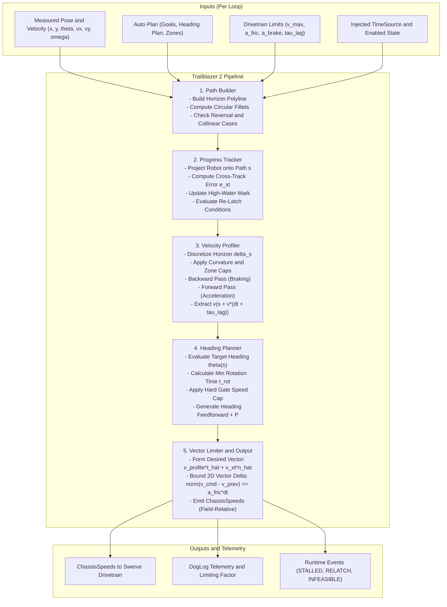
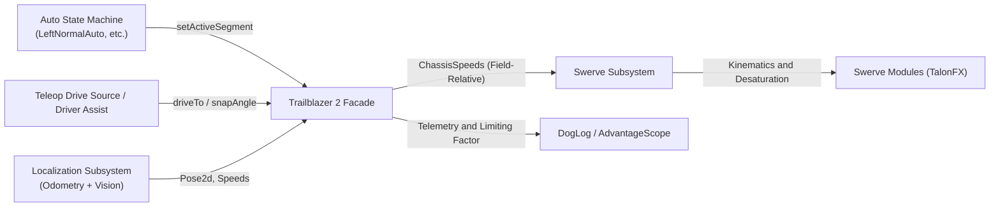

# Trailblazer 2 Design Specification: Overview and System Architecture

**Document ID:** TB2-SPEC-00
**Status:** Approved for Implementation
**Author:** Team 581 Technical Staff
**Applies To:** `com.team581.trailblazer2`, `shared`, `comp-bot`, `offseason-bot`

---

## 1. Executive Summary

Trailblazer 2 is Team 581's next-generation autonomous motion specification, generation, and following system for holonomic swerve drivetrains. It replaces the heuristic tracking, PID distance-attenuated velocity scaling, and asymmetric acceleration limiting of Trailblazer 1 with an online, arc-length parameterized, physically feasible motion planner.

Trailblazer 2 preserves the foundational design philosophy that made Trailblazer 1 dependable:
1. **Pure code execution:** No brittle external GUI trajectory compilation required to deploy code.
2. **Path-parameterized (not time-parameterized):** Motion setpoints are indexed by spatial progress ($s$), never by an open-loop clock ($t$). The robot cannot be "left behind" by its trajectory when delayed by defense, terrain bumps, or game piece ingestion.
3. **Uncompromising agility:** Instantaneous recovery from disturbances without trajectory invalidation.
4. **Seamless Auto and Teleop unification:** Single API for 15-second autonomous routines, driver assistance, dynamic target acquisition, and teleop drive-to-pose commands.

---

## 2. Comparative Analysis: Trailblazer 1 vs. Alternatives

To ensure Trailblazer 2 addresses all operational limitations while maintaining its competitive edge, the architecture is evaluated against Trailblazer 1, Choreo (Sleipnir), PathPlanner Lib, and 254-style Quintic Hermite Spline followers.

| Evaluation Metric | Trailblazer 1 (Current) | Choreo (Sleipnir) | PathPlanner Lib | 254 Quintic Hermite | Trailblazer 2 (Target) |
| :--- | :--- | :--- | :--- | :--- | :--- |
| **Parameterization** | Heuristic $t \in [0, 1]$ per point | Clock time $t$ | Clock time $t$ | Arc length $s$ or time $t$ | **Spatial arc length $s$ (Horizon)** |
| **Perturbation Recovery** | Natural, but jerky; sudden target jumps | Poor; trajectory invalidation; needs replan | Moderate; PID error winds up unless replanning | Moderate; requires high-gain cross-track feedback | **Instantaneous by construction; re-solves online** |
| **Cornering & Kinematics** | Linear PID + target line-of-sight; infinite lateral acceleration | Full swerve torque & friction limits | Centripetal acceleration clamp on Bézier curve | Curvature-bounded $\kappa(s)$ with $a_{lat} \le \mu g$ | **Circular fillets + 2-pass curvature profile + 2D vector limiter** |
| **Acceleration Symmetry** | Asymmetric: slew-limits accel up, zero decel limit along path | Symmetric (optimal) | Symmetric (trapezoidal) | Symmetric (trapezoidal / S-curve) | **Symmetric (forward-backward DP + friction circle limiter)** |
| **Heading Coupling** | Ad-hoc angular velocity caps; mid-arc flip | Coupled optimal NLP | Independent profile | Coupled or decoupled Hermite | **Decoupled schedule $\theta(s)$ with hard/soft gates** |
| **Dynamic / Sensor Goals** | Supported via `Supplier<Point>` | Not supported (offline only) | Limited on-the-fly pathfinding | Requires re-splining | **First-class online horizon integration** |
| **Teleop Integration** | Ad-hoc (e.g. `CLIMB_ASSIST`) | Unusable in teleop | Separate pathfinding wrapper | Custom assist controllers | **Uniform interface for Auto and Teleop** |
| **Tooling & CI** | No preview; tuning on field carpet | Desktop UI + export | Desktop GUI + export | Simulation scripts | **Java DSL + MVP gradlew previewAuto + Live App** |

### 2.1 The Case Against Time-Parameterized Trajectories in FRC
In high-level competitive FRC, field interactions are non-deterministic:
- **Defense & Collisions:** A defensive robot pinning or nudging the chassis for 0.4 seconds causes a time-indexed controller ($t \to \mathbf{x}(t)$) to advance setpoints meters ahead. When released, the feedback controller demands maximum saturation, leading to wheel slip, loss of traction, and trajectory overshoot.
- **Field Obstacles (Bumps/Ramps):** When crossing field terrain (such as the 2026 bump), normal wheel-carpet traction is broken. A time-based profile continues advancing, leading to catastrophic phase lag upon re-landing.
- **Intake Jamming / Delays:** If an intake roller requires 200 ms longer to intake a game piece, a spatial system pauses progress naturally; a time-based system rushes forward into an empty queue.

Trailblazer 2 solves this by treating the path as a **spatial manifold**. The robot's progress $s$ along the path dictates its target velocity $v(s)$, not clock time.

---

## 3. Core Design Principles

Trailblazer 2 adheres to six fundamental architectural rules:

1. **Re-Solve, Do Not Replay:** The planner is a pure function of measured state $\mathbf{x} = (x, y, \theta, v_x, v_y, \omega)$, the active spec, and physical drivetrain limits. Its persistent state is strictly minimal: active segment index, latched leg origin, progress high-water mark, and last commanded velocity vector $\vec{v}_{cmd}$.
2. **Intent in the Spec, Geometry Derived:** The user declares intent ("pass within 0.3 m of this waypoint", "stop at this goal within 0.05 m", "face 90° before reaching marker"). Corner radii, tangent blend lengths, and pass speeds are derived automatically from drivetrain physics.
3. **Physical Parameters Measured Once:** Top speed ($v_{max}$), free-speed acceleration curve ($a_0, v_{free}$), braking deceleration ($a_{brake}$), lateral friction limit ($a_{lat}$), and drivetrain lag ($\tau_{lag}$) belong to the physical chassis. Autos are written in normalized profiles (`fast`, `careful`, `intake`), never tuned per-point with magic numbers.
4. **Feasible by Construction:** Over-limit commands are mathematically impossible. The two-pass spatial velocity profiler bounds longitudinal and lateral limits, and a 2D vector acceleration limiter bounds directional step changes within the friction circle.
5. **One Planner Everywhere:** The identical planning algorithm executes on the roboRIO during matches, in desktop unit tests, in headless CI simulation, and during log replay. All external dependencies (time, driver station status, localization) are injected via interfaces.
6. **Fail Visibly:** The planner never degrades silently. Every 20 ms loop logs the exact constraint governing velocity (`CORNER_CENTRIPETAL`, `ZONE_CAP`, `HEADING_GATE`, `BRAKING_STOP`, `ACCEL_LIMIT`), and abnormal dynamics (stalls, pose jumps, infeasible specs) raise typed events.

---

## 4. End-to-End Runtime Pipeline

Every control loop execution (nominally 20 ms / 50 Hz, or 10 ms / 100 Hz), Trailblazer 2 processes five discrete, stateless calculation stages:



### 4.1 Minimal Persistent State Model
The pipeline is strictly functional, with persistent state confined to:
```java
public final class TrailblazerState {
    int segmentIndex;              // Currently active segment in state machine
    Translation2d latchedLegStart; // Origin of current leg for cross-track reference
    double progressHighWaterMark;  // Monotonic arc-length s reached along current segment
    ChassisSpeeds lastCommand;     // Previous loop's emitted velocity vector
    double lastTimestamp;          // Previous loop timestamp for dynamic dt
}
```
If localization jumps or the robot is shoved laterally beyond `e_relatch`, `latchedLegStart` re-anchors to the robot's current position, and the forward profiler initializes with `lastCommand`. No trajectory tree is pruned; no replanning latency occurs.

---

## 5. Subsystem Interface Architecture

Trailblazer 2 acts as the **guidance and planning layer**, decoupled from low-level drivetrain motor control and high-level match state machines.



### 5.1 Separation of Responsibilities
1. **Auto State Machine (`BaseImperativeAuto`):** Governs match logic, subsystem coordination (intake, shooter, climber), and segment sequencing using event markers (`passedMarker`) and goal arrival (`atGoal`).
2. **Trailblazer 2 (`Trailblazer`):** Ingests goal coordinates and drivetrain capabilities. Solves geometry, velocity profiles, heading alignment, and vector acceleration limits. Outputs continuous field-relative `ChassisSpeeds`.
3. **Swerve Subsystem (`Swerve`):** Ingests field-relative `ChassisSpeeds`. Translates into robot-relative speeds, performs module inverse kinematics, wheel velocity desaturation, and azimuth motor steering control.
4. **Localization (`Localization`):** Blends high-frequency wheel odometry with low-latency AprilTag vision updates. Trailblazer 2 relies on localization as an external sensor input.

---

## 6. Specification Suite Roadmap

To provide complete implementation blueprints, the Trailblazer 2 design is partitioned into the following formal specification documents:

- **[TB2-SPEC-01: Path Geometry & Kinematics Specification](01-path-geometry-and-kinematics.md)**
  Fillet mathematics, deviation formulas, collinear/reversal edge cases, spatial projection, monotonic progress tracking, and re-latching mechanics.
- **[TB2-SPEC-02: Velocity Profiling & Physical Limits Specification](02-velocity-profiler-and-limits.md)**
  Two-pass forward-backward dynamic programming profiler along arc length, lateral centripetal limits, motor torque-speed curves, symmetric 2D vector slew limiter, and latency compensation.
- **[TB2-SPEC-03: Holonomic Heading Scheduling & Coupling Specification](03-heading-and-rotation.md)**
  Decoupled heading plans, keyframes, rotational direction disambiguation, hard vs. soft gates, and translation speed-capping mechanics.
- **[TB2-SPEC-04: Teleop Integration & Dynamic Assist Specification](04-teleop-and-dynamic-assist.md)**
  On-the-fly single-goal alignment, driver stick override blending, vision target tracking, and terrain-specific assist modes.
- **[TB2-SPEC-05: Java Specification Model, DSL & Tooling Specification](05-spec-model-dsl-and-tooling.md)**
  Canonical Java Fluent DSL, centralized `FieldAnchors.java`, alliance mirroring, MVP `./gradlew previewAuto` task with AdvantageScope `.wpilog` & PNG exports, and final in-memory live previewer app.
- **[TB2-SPEC-06: Verification, Simulation & CI Specification](06-verification-simulation-and-ci.md)**
  Deterministic test harnesses via `TimeSource`, unit & fuzz testing, closed-loop simulation with perturbation sweeps, golden metrics, and automated PR checks.
- **[TB2-SPEC-07: Empirical Drivetrain Calibration Specification](07-empirical-calibration-routine.md)**
  Automated on-robot calibration routines to measure top speed, motor acceleration curves, braking deceleration, tire friction coefficient, and response lag.
- **[TB2-SPEC-08: Implementation Roadmap & Migration Plan](08-implementation-roadmap-and-migration.md)**
  Phased rollout schedule, compatibility adapter layer, testing gates, risk mitigation, and retirement criteria for legacy classes.
