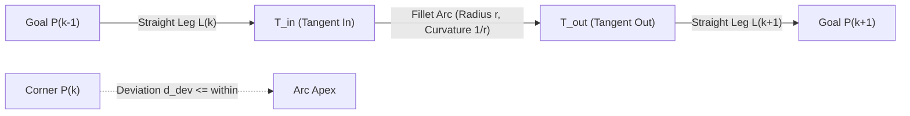

# Trailblazer 2 Design Specification: Path Geometry & Kinematics

**Document ID:** TB2-SPEC-01  
**Status:** Approved for Implementation  
**Author:** Team 581 Technical Staff  
**Applies To:** `PathBuilder`, `ProgressTracker`, `AutoGeometry`  

---

## 1. Geometric Model Overview

In Trailblazer 1, path geometry was defined as a discrete sequence of waypoints connected by straight lines, with arc extensions manually parameterized via quadratic Bézier curves and hand-typed midpoint offsets. Waypoint advancement was tied directly to entering an arbitrary `transitionTolerance` circle, which conflated the arrival condition with corner-cutting geometry.

In Trailblazer 2, path geometry is a continuous, $G^1$-continuous piecewise curve composed of:
1. **Straight Line Segments:** Connecting waypoints outside of turn zones. Curvature $\kappa = 0$.
2. **Circular Fillet Arcs:** Connecting adjacent line segments at interior corners. Curvature $\kappa = \frac{1}{r}$.

Every interior corner is rounded automatically based on the author's specified `within` tolerance, adjacent leg lengths, and drivetrain lateral acceleration limits. The author never inputs Bezier control points or guesses corner tangent lengths.



---

## 2. Circular Fillet Mathematics

Consider three consecutive goals: $P_{k-1}$, $P_k$, and $P_{k+1}$ in 2D space.

Let incoming leg vector be $\vec{L}_{in} = P_k - P_{k-1}$, with length $L_{in} = \|\vec{L}_{in}\|$.  
Let outgoing leg vector be $\vec{L}_{out} = P_{k+1} - P_k$, with length $L_{out} = \|\vec{L}_{out}\|$.

Unit direction vectors:
$$\hat{u} = \frac{\vec{L}_{in}}{L_{in}}, \quad \hat{v} = \frac{\vec{L}_{out}}{L_{out}}$$

### 2.1 Corner Deflection Angle $\theta$ and Turn Orientation
The corner deflection angle magnitude $\theta \in [0, \pi)$ represents the unsigned angular change between legs:
$$\theta = \left| \mathrm{atan2}\left(u_x v_y - u_y v_x, \; u_x v_x + u_y v_y\right) \right|$$

Taking the absolute value is critical: a signed angle ($\theta < 0$ for clockwise turns) would yield a negative tangent length $t = r \tan(\theta/2) < 0$, corrupting fillet geometry and arc length parameterization.

The turn direction sign $\sigma_{turn} \in \{-1, +1\}$ is preserved separately to position the fillet circle center $C$:
$$\sigma_{turn} = \mathrm{sgn}(u_x v_y - u_y v_x) \quad (+1 = \text{Left / CCW turn}, \; -1 = \text{Right / CW turn})$$

- $\theta = 0$: Collinear, straight motion (no turn).
- $\theta = \frac{\pi}{2}$ ($90^\circ$): Right-angle turn.
- $\theta \to \pi$ ($180^\circ$): Complete directional reversal.

### 2.2 Tangent Length $t$ and Maximum Corner Deviation $d_{dev}$
For a circular fillet of radius $r$:
The tangent length $t$ (distance from corner $P_k$ to the tangent contact points $T_{in}$ and $T_{out}$ along the legs) is:
$$t = r \tan\left(\frac{\theta}{2}\right)$$

The maximum deviation $d_{dev}$ from the sharp corner $P_k$ to the closest point on the circular arc (the arc apex) is:
$$d_{dev} = r \left( \frac{1}{\cos(\theta/2)} - 1 \right) = r \left( \sec\left(\frac{\theta}{2}\right) - 1 \right)$$

```
          P_k (Goal)
          / \
         /   \
        /     \
  T_in *   .   * T_out
      /     .   \
     /    d_dev  \
    /       .     \
   /      [Arc]    \
  /                 \
P_{k-1}             P_{k+1}
```

### 2.3 Radius Bounds & Derivation
The fillet radius $r$ at corner $k$ is bounded by three competing physical and geometric constraints:

1. **Author's Deviation Tolerance (`within` $\delta$):**
   The path must not cut the corner deeper than $\delta$ meters:
   $$d_{dev} \le \delta \implies r_{\delta} = \frac{\delta}{\frac{1}{\cos(\theta/2)} - 1}$$
   *(When $\theta \to 0$, $r_{\delta} \to \infty$; the corner is unconstrained by deviation).*

2. **Available Leg Lengths (No Fillet Overlap):**
   A fillet cannot consume more than its fair share of adjacent legs. To prevent fillets from overlapping, the tangent length $t$ is clamped:
   $$t \le t_{max} = \min\left(\eta \cdot L_{in}, \; \eta \cdot L_{out}\right)$$
   where $\eta = 0.5$ allocates up to half of each leg to the corner.
   When adjacent corners have unequal requirements, a global tangent allocation pass scales $t_{out, k-1}$ and $t_{in, k}$ proportionally such that:
   $$t_{out, k-1} + t_{in, k} \le L_k$$
   Given the clamped tangent $t_{clamped}$:
   $$r_{geom} = \frac{t_{clamped}}{\tan(\theta/2)}$$

3. **Pass Speed Request ($v_{pass}$):**
   If the author specifies a target pass speed $v_{pass}$ through the goal, the radius must be large enough to satisfy lateral acceleration limits $a_{lat}$:
   $$a_{lat} \ge \frac{v_{pass}^2}{r} \implies r_{req} = \frac{v_{pass}^2}{a_{lat}}$$

**Final Fillet Radius Selection:**
The effective radius for the corner is:
$$r_k = \min\left(r_{\delta}, \; r_{geom}\right)$$
If $r_k < r_{req}$, the path is still geometrically valid, but the velocity profiler will automatically limit the pass speed to $v = \sqrt{a_{lat} \cdot r_k}$. In simulation and CI, a warning is raised if an author requested $v_{pass}$ that the geometry cannot support.

---

## 3. Boundary Conditions & Geometric Edge Cases

### 3.1 Collinear Segments ($\theta < 10^{-4}$ rad)
When waypoints are collinear or near-collinear:
- $\tan(\theta/2) \to 0$ and $\cos(\theta/2) \to 1$.
- The denominator of $r_{\delta}$ approaches zero.
- **Handling:** If $\theta < 1.0^\circ$ ($0.0175$ rad), the fillet is omitted ($r = 0, t = 0$). The two legs are merged into a continuous straight line segment with $\kappa = 0$.

### 3.2 Sharp Turns and Directional Reversals ($\theta \ge 135^\circ$)
When turn angle $\theta$ becomes large ($\theta \to 180^\circ$):
- Tangent length $t = r \tan(\theta/2) \to \infty$. A circular fillet cannot fit on finite legs without requiring large tangent distances.
- Holonomic drivetrains cannot reverse translation direction instantaneously at non-zero speed without infinite wheel acceleration and wheel scrubbing.
- The tangent allocation clamp ($t \le t_{max} = \min(\eta L_{in}, \eta L_{out})$) naturally scales down the permissible fillet radius $r_{geom} = t_{clamped} / \tan(\theta/2) \to 0$, forcing pass speed $v = \sqrt{a_{lat} \cdot r}$ toward zero.

Rather than imposing an arbitrary cliff at $150^\circ$ that abruptly converts a continuous waypoint into an unexpected stop, Trailblazer 2 follows two explicit design rules:
1. **Explicit Stop Declarations:** Directional reversals or intentional halts must be declared explicitly in code using `Goal.stop(...)`.
2. **Sharp Turn Previewer Warnings:** For sharp turns where $\theta \ge 135^\circ$ ($2.356$ rad), if authored as `Goal.through(...)`, the geometry and centripetal acceleration limits naturally bottleneck pass speed to a crawl. The CLI previewer and simulation raise an informational warning:
   > `WARN: Sharp turn of 142.5° at goal 'depot_corner' bottlenecks pass speed to 0.42 m/s. If a full directional halt was intended, use Goal.stop() instead.`
   This prevents invisible behavior changes from minor waypoint tweaks while ensuring physical consistency.

### 3.3 Explicit Stop Goals (`Goal.stop(...)`)
Any goal declared with `Goal.stop(...)` has:
- $r = 0$, $t = 0$.
- No fillet is constructed. The robot travels along the straight line directly to $P_k$.
- The velocity profiler pins the exit speed at $P_k$ to $0.0$ m/s.

---

## 4. Horizon Construction

Rather than precomputing an entire multi-stage autonomous routine, Trailblazer 2 constructs a **planning horizon** each loop.

### 4.1 Horizon Depth Calculation
The horizon must extend far enough that any future constraint cannot alter the current loop's acceleration decision. Under maximum speed $v_{max}$ and braking deceleration $a_{brake}$:
$$d_{horizon} = \frac{v_{max}^2}{2 \cdot a_{brake}} + d_{margin}$$
*Example:* For $v_{max} = 4.75$ m/s and $a_{brake} = 4.0$ m/s$^2$, braking distance is $\frac{4.75^2}{8} \approx 2.82$ m. With $d_{margin} = 1.0$ m, $d_{horizon} \approx 3.82$ m.

### 4.2 Horizon Termination Criteria
The path builder ingests goals forward from the robot's current leg until:
1. Cumulative path length along the horizon exceeds $d_{horizon}$, **OR**
2. A goal declared with `Goal.stop(...)` is reached, **OR**
3. The end of the active segment is reached.

Any goal beyond a `Goal.stop(...)` goal has zero causal influence on the current command, because the robot must come to a complete rest at the stop goal regardless. This keeps horizon construction bounded to $O(K)$ where $K \le 5$ goals.

---

## 5. Progress Tracking & Spatial Parameterization

The path within the horizon is parameterized by cumulative arc length $s \in [0, S_{total}]$.

```
s = 0                                                             s = S_total
|------------------*~~~~~~~~~~~~~*-----------------------------------|
[Straight Leg 1]  T_in   [Arc]   T_out        [Straight Leg 2]
```

### 5.1 Piecewise Arc Length Discretization
For a path with $M$ pieces (alternating straight lines and arcs):
- **Straight Segment $i$:** Length $\Delta s_i = L_i - t_{in, i} - t_{out, i}$.
  Position at local distance $l \in [0, \Delta s_i]$:
  $$\mathbf{r}(l) = \mathbf{x}_{start, i} + l \cdot \hat{u}_i, \quad \kappa(l) = 0$$
- **Fillet Arc $j$:** Radius $r_j$, arc angle $\theta_j$.
  Arc length $\Delta s_j = r_j \cdot \theta_j$.
  Position at local angle $\phi \in [0, \theta_j]$:
  $$\mathbf{r}(\phi) = \mathbf{C}_j + r_j \begin{bmatrix} \cos(\alpha_{start, j} + \sigma_j \phi) \\ \sin(\alpha_{start, j} + \sigma_j \phi) \end{bmatrix}, \quad \kappa = \frac{1}{r_j}$$
  where $\mathbf{C}_j$ is the circle center and $\sigma_j \in \{+1, -1\}$ denotes turn direction (counter-clockwise or clockwise).

### 5.2 Robot Orthogonal Projection onto Path
Each loop, the robot's measured position $\mathbf{p}_{robot} = (x, y)$ is projected orthogonally onto the path:
1. For each piece $m$ in the active horizon:
   - Calculate closest point $\mathbf{p}^*_m$ and orthogonal distance $d_m = \|\mathbf{p}_{robot} - \mathbf{p}^*_m\|$.
   - Determine local parameter $s_m$.
2. Global projection $s_{meas}$ is the point corresponding to $\min_m d_m$.
3. Cross-track error $e_{xt}$ is the signed distance from the path tangent $\hat{t}$:
   $$e_{xt} = (\mathbf{p}_{robot} - \mathbf{p}^*) \cdot \hat{n}$$
   where $\hat{n} = \begin{bmatrix} -t_y \\ t_x \end{bmatrix}$ is the path unit normal.

### 5.3 Monotonic Progress Ratcheting
Sensor noise or vision pose updates can momentarily shift the measured pose backwards. To prevent velocity profile chatter:
$$s = \max\left(s_{high\_water}, \; s_{meas}\right)$$
$s_{high\_water}$ ratchets monotonically forward as the robot drives along a segment. It is only reset when an explicit re-latch occurs.

---

## 6. Latching and Re-Latching Mechanics

A known failure mode of pure pursuit or vector field planners that replan from the robot's current position every loop is **cross-track amnesia**: if the path origin is always the robot's current pose, cross-track error is by definition zero, and the robot never corrects back to the intended corridor.

Trailblazer 2 solves this via **leg latching**:
1. When entering a new leg, the starting anchor $\mathbf{p}_{start}$ is latched:
   - For leg 0: Latched to the robot's measured position at the exact moment of segment activation.
   - For subsequent legs: Latched to the end of the previous leg's fillet tangent $T_{out}$.
2. The nominal path line is fixed in space between $\mathbf{p}_{start}$ and $P_k$. Cross-track error $e_{xt}$ is measured against this fixed reference.

### 6.1 Re-Latch Triggers
The planner discards the latched line and re-anchors to the robot's current measured position under three specific events:

1. **Gross Cross-Track Deviation ($|e_{xt}| > e_{relatch}$):**
   If a severe disturbance (e.g. high-speed robot collision) knocks the chassis farther than $e_{relatch}$ (default: $0.40$ m) off course, forcing the robot back to the old line creates an acute turn. The planner re-latches: current pose becomes the new start, drawing a fresh tangent to the upcoming goal.
2. **Vision Pose Discontinuity ($\|\mathbf{p}_{robot} - \mathbf{p}_{last}\| > \Delta p_{vision}$):**
   When an AprilTag observation causes a discrete jump in estimated pose (e.g. $> 0.25$ m in one 20 ms loop), retaining the old latch causes artificial cross-track spikes. The planner detects the step change, re-latches, and logs `EVENT_POSE_JUMP_RELATCH`.
3. **Active Segment Change:**
   Transitioning between auto states in `BaseImperativeAuto` automatically latches leg 0 from current pose.

### 6.2 Velocity Continuity Invariant Across Re-Latch
**Crucial Invariant:** Re-latching updates *geometry*, but **never** resets commanded velocity.  
When a re-latch occurs:
- The initial velocity for the forward profiler pass $v_0$ is set to $\|\vec{v}_{last\_command}\|$.
- The direction change from the old path tangent to the new re-latched path tangent is smoothed by the **2D Vector Limiter** over subsequent loops ($a_{fric} \cdot \Delta t$).
- Result: Zero acceleration discontinuity, zero motor jerking, zero wheel slip.

---

## 7. Dynamic and Supplier-Based Goals

For use cases such as game piece alignment (`getCollisionPoint` in `LeftNormalAuto`) or dynamic vision tracking, goal poses are passed as `Supplier<Pose2d>`.

### 7.1 Dynamic Leg Updates
- If a goal pose changes while it is inside the horizon, the path builder evaluates the supplier each loop.
- The latched start $\mathbf{p}_{start}$ remains fixed; the leg vector $\vec{L} = P_{goal}(t) - \mathbf{p}_{start}$ rotates smoothly.
- Fillet radius and tangent points recompute algebraically in real time.
- If the goal moves faster than a filter threshold, an exponential low-pass filter ($\tau = 0.10$ s) on supplier position prevents geometric chatter.
