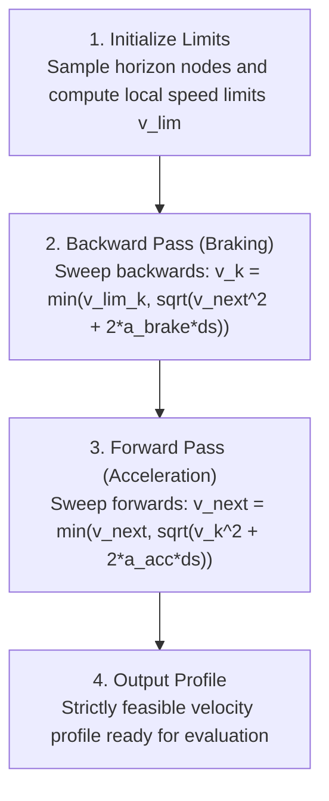

# Trailblazer 2 Design Specification: Velocity Profiling & Physical Limits

**Document ID:** TB2-SPEC-02  
**Status:** Approved for Implementation  
**Author:** Team 581 Technical Staff  
**Applies To:** `VelocityProfiler`, `DrivetrainLimits`, `VectorLimiter`, `ConstraintsCalculator` (replacement)  

---

## 1. Problem Statement: Deficiencies of Trailblazer 1

Trailblazer 1 velocity generation suffered from four fundamental physical shortcomings:

1. **Uncalibrated Speed Shaping:** Velocity was calculated via a distance-to-end PID controller:
   $$\text{speed} = \left| \text{translationController.calculate}(d_{end}, 0) \right|$$
   This produced arbitrary exponential decays rather than physically bounded linear or trapezoidal decelerations, forcing authors to tune PID gains to achieve acceptable stopping behavior.
2. **Asymmetric Acceleration Limiting:** `ConstraintsCalculator.constrainLinearVelocity` clamped upward velocity changes:
   $$v_{command} = \min\left(v_{desired}, \; v_{last} + a \cdot \Delta t\right)$$
   However, downward velocity drops were completely unconstrained except for a braking curve to the final segment end. When reaching an intermediate waypoint with a lower speed constraint, requested velocity dropped instantaneously, commanding infinite deceleration from swerve drive motors.
3. **Discontinuous Velocity Jump at Rest:** A hardcoded floor allowed a stationary robot to instantly jump to $0.5$ m/s in a single 20 ms loop, producing wheel slip on start:
   $$\text{maxReachableVelocity} = \max(v_{last} + a \cdot \Delta t, \; 0.5)$$
4. **Unbounded Directional Step Changes:** Magnitude was capped, but direction was computed as the pure line-of-sight vector to the target point (`MathHelpers.getDriveDirection`). When transitioning between waypoints, direction jumped discontinuously, demanding infinite centripetal acceleration ($a_{lat} \to \infty$) and causing severe module scrubbing.

Trailblazer 2 eliminates all four deficiencies through a **spatial two-pass dynamic programming profiler** coupled to an isotropic **2D vector slew rate limiter**.

---

## 2. Drivetrain Physical Limits Model

Instead of guessing constraints per auto (`LinearConstraintOptions(4.5, 8.0)`), physical properties are measured once for the robot and stored in a immutable record:

```java
public record DrivetrainLimits(
    double maxLinearVelocity,       // v_max (m/s): Top gearing speed on carpet
    double freeLinearAcceleration,  // a_0 (m/s^2): Stall/zero-speed acceleration
    double motorFreeSpeed,          // v_free (m/s): Motor theoretical free speed
    double maxBrakingDeceleration,  // a_brake (m/s^2): Maximum traction-limited braking
    double frictionLimit,           // a_fric (m/s^2): Peak isotropic tire traction (μ * g)
    double maxLateralAcceleration,  // a_lat (m/s^2): Max cornering acceleration before drift
    double maxAngularVelocity,      // omega_max (rad/s): Maximum rotation rate
    double maxAngularAcceleration,  // alpha_max (rad/s^2): Maximum rotational acceleration
    double driveResponseLagSeconds, // tau_lag (s): First-order velocity tracking lag (~0.04s)
    double crossTrackTimeConstant,  // tau_xt (s): Cross-track convergence time constant (~0.25s)
    double maxCrossTrackCorrection  // v_xt_max (m/s): Maximum lateral correction velocity (~1.2m/s)
) {}
```

### 2.1 Motor Curve Acceleration Model
DC brushless motor drive trains (Kraken X60 / Falcon 500) exhibit linear torque-speed falloff:
$$a_{motor}(v) = a_0 \left( 1 - \frac{v}{v_{free}} \right)$$
At zero speed, acceleration is capped by tire traction ($a_{fric}$). At high speed, acceleration decays linearly toward zero at free speed.

---

## 3. Two-Pass Spatial Horizon Profiler

The horizon path of total length $S_{horizon}$ is discretized at uniform arc-length intervals $\Delta s$ (default: $\Delta s = 0.05$ m, or 5 cm).  
This yields $N = \lceil S_{horizon} / \Delta s \rceil$ discrete nodes $k \in \{0, 1, \dots, N-1\}$.

```
Node:     0        1        2        k       k+1               N-1 (End)
Arc (s):  0.00     0.05     0.10 ... s_k     s_{k+1} ...       S_horizon
          |--------|--------|--------|--------|-----------------|
                   Δs = 0.05m
```

### 3.1 Node-Level Limit Formulation
At each spatial sample $k$, the local velocity limit $v_{lim, k}$ is bounded by:
1. **Global Velocity Limit:** $v_{max}$
2. **Curvature / Centripetal Acceleration Limit:**
   For local path curvature $\kappa_k = \frac{1}{r_k}$:
   $$a_{lat} \ge v^2 \kappa_k \implies v_{corner, k} = \sqrt{\frac{a_{lat}}{\kappa_k + \epsilon}}$$
   *(On straight segments where $\kappa_k = 0$, $v_{corner, k} = \infty$).*
3. **Zone Constraints:** $v_{zone, k}$ (e.g. speed caps inside trench or scoring areas).
4. **Goal Exit Constraints:** If sample $k$ corresponds to a `stop` goal, $v_{goal, k} = 0.0$. If a `through(v_{pass})` goal, $v_{goal, k} = v_{pass}$.

The composite speed ceiling at sample $k$ is:
$$v_{lim, k} = \min\left(v_{max}, \; \sqrt{\frac{a_{lat}}{\kappa_k + \epsilon}}, \; v_{zone, k}, \; v_{goal, k}\right)$$

### 3.2 Friction Circle Coupling (Tangential Acceleration Capacity)
When cornering at speed $v_k$, lateral acceleration $a_{lat, k} = v_k^2 \kappa_k$ consumes a portion of available tire friction ($a_{fric}$).  
By the circular friction envelope ($a_{tangential}^2 + a_{lateral}^2 \le a_{fric}^2$), the remaining tangential acceleration capacity is:
$$a_{t, k} = \sqrt{\max\left(0, \; a_{fric}^2 - (v_k^2 \kappa_k)^2\right)}$$

Effective braking deceleration at node $k$:
$$a_{brake, k} = \min\left(a_{brake}, \; a_{t, k}\right)$$

Effective forward motor acceleration at node $k$:
$$a_{acc, k} = \min\left(a_0 \left(1 - \frac{v_k}{v_{free}}\right), \; a_{t, k}\right)$$

### 3.3 Dynamic Programming Sweeps

#### Pass 1: Backward Pass (Enforcing Braking Limits)
The backward pass iterates from the horizon terminus $k = N-1$ down to the robot's current position $k = 0$. It propagates braking deceleration backwards to guarantee the robot can stop or slow down in time for all upcoming corners and goals:
1. Initialize terminal node: $v_{N-1} = v_{lim, N-1}$.
2. For $k = N-2$ down to $0$:
   $$v_k \leftarrow \min\left(v_{lim, k}, \; \sqrt{v_{k+1}^2 + 2 \cdot a_{brake, k} \cdot \Delta s}\right)$$

#### Pass 2: Forward Pass (Enforcing Motor Acceleration Limits)
The forward pass sweeps from $k = 0$ up to $N-1$, ensuring velocity does not increase faster than available motor torque and traction:
1. Initialize origin node $k = 0$:
   $$v_0 = v_{start}$$
2. For $k = 0$ up to $N-2$:
   $$v_{k+1} \leftarrow \min\left(v_{k+1}, \; \sqrt{v_k^2 + 2 \cdot a_{acc, k} \cdot \Delta s}\right)$$



### 3.4 Initial Velocity Selection and Chatter Elimination
To guarantee smooth control and avoid velocity chatter caused by noisy wheel odometry:
- Under nominal tracking: $v_{start} = \|\vec{v}_{last\_command}\|$.
- **Disturbance / Slip Override:** If measured chassis velocity diverges significantly from the last command:
  $$\left| \|\vec{v}_{meas}\| - \|\vec{v}_{last\_command}\| \right| > v_{diverge\_thresh} \quad (0.75 \text{ m/s})$$
  $v_{start}$ re-seeds to $\|\vec{v}_{meas}\|$ to prevent integrator windup and acknowledge physical slip or severe collision.

---

## 4. Latency Compensation (Lookahead Advance)

RoboRIO CAN latency, motor controller velocity filter lag, and swerve azimuth steering response introduce an effective system lag $\tau_{lag} \approx 0.040$ s (40 ms).  
If the controller commands the profile speed at the exact current position $s$, the robot will consistently lag behind the intended setpoint.

Trailblazer 2 evaluates the profile at an advanced lookahead arc length:
$$s_{eval} = s + v \cdot \left(\Delta t + \tau_{lag}\right)$$
The profiler interpolates linearly between sample nodes $k$ and $k+1$ at $s_{eval}$ to extract:
- Profile tangential speed: $v_{profile}$
- Unit path tangent: $\hat{t}$
- Unit path normal: $\hat{n}$

---

## 5. Cross-Track Control and 2D Vector Slew Limiter

The nominal feedforward velocity vector along the path is $v_{profile} \hat{t}$. To eliminate cross-track error $e_{xt}$, a proportional correction velocity is injected along path normal $\hat{n}$:
$$v_{xt} = \mathrm{clamp}\left(\frac{e_{xt}}{\tau_{xt}}, \; -v_{xt, max}, \; v_{xt, max}\right)$$
where $\tau_{xt}$ is the cross-track convergence time constant (default: $0.25$ s).

The unconstrained desired chassis velocity vector is:
$$\vec{v}_{des} = v_{profile} \hat{t} + v_{xt} \hat{n}$$

```
              ^ n̂ (Path Normal)
              |
              |   v_xt
              +----------+ v_des
              |         /
              |        /
              |       / v_profile
              |      /
              |     /
              |    /
  ------------+-------------------> t̂ (Path Tangent)
            Robot
```

### 5.1 Isotropic 2D Vector Acceleration Clamp
To guarantee that the physical drivetrain friction limit ($a_{fric}$) is never exceeded in any 2D direction, the change in the velocity vector between loops is bounded:

Let $\Delta t$ be loop elapsed time.  
Maximum allowable change in velocity magnitude:
$$\Delta v_{max} = a_{fric} \cdot \Delta t$$

The delta velocity vector from the previous loop's command $\vec{v}_{prev}$ is:
$$\Delta \vec{v} = \vec{v}_{des} - \vec{v}_{prev}$$

If $\|\Delta \vec{v}\| > \Delta v_{max}$:
$$\vec{v}_{cmd} = \vec{v}_{prev} + \Delta \vec{v} \cdot \left( \frac{\Delta v_{max}}{\|\Delta \vec{v}\|} \right)$$
Else:
$$\vec{v}_{cmd} = \vec{v}_{des}$$

### 5.2 Mathematical Guarantees of the 2D Vector Limiter
1. **Perfect Acceleration/Braking Symmetry:** A speed drop is limited by the exact same vector magnitude as a speed increase.
2. **Smooth Corner Entry:** When turning a corner or re-latching, the path tangent $\hat{t}$ changes direction. The vector limiter prevents instantaneous velocity vector snapping, smoothly rotating the velocity vector at rate:
   $$\dot{\theta}_{vel} \le \frac{a_{fric}}{v}$$
3. **No Motor Over-Current:** Because the rate of change of module wheel setpoints is strictly bounded by chassis acceleration, motor current spikes and brownouts are eliminated.

---

## 6. Runtime Performance & Zero-Allocation Architecture

The profiler executes on the roboRIO every 20 ms. To prevent garbage collection pauses:
- All arrays for the horizon (`double[] s_nodes`, `double[] v_lim`, `double[] v_profile`, `double[] kappa`) are preallocated once at subsystem initialization:
  $$\text{Array Capacity} = \lceil 8.0 \text{ m} / 0.05 \text{ m} \rceil = 160 \text{ elements}$$
- Loop execution performs purely primitive in-place arithmetic.
- **Benchmark Target:** A 160-sample, 2-pass dynamic programming solve executes in $< 35 \; \mu\text{s}$ on a standard roboRIO 1 / roboRIO 2 CPU (consuming $< 0.18\%$ of the 20 ms loop budget).

---

## 7. Telemetry & Limiting Factor Diagnostics

To satisfy the "Fail Visibly" design principle, every loop logs the active constraint governing robot velocity:

```java
public enum LimitingFactor {
    TOP_SPEED,           // Governed by drivetrain v_max
    CORNER_CENTRIPETAL,  // Governed by sqrt(a_lat / kappa)
    ZONE_SPEED_CAP,      // Governed by active field zone rule
    GOAL_DECELERATION,   // Governed by backward pass stopping profile
    MOTOR_ACCELERATION,  // Governed by forward pass motor curve
    HEADING_HARD_GATE,   // Translation paced to wait for rotation
    VECTOR_SLEW_LIMIT    // Delta-v clamped by friction circle
}
```

Every loop publishes `Trailblazer/LimitingFactor` to DogLog and NetworkTables. When diagnosing an auto, AdvantageScope displays an intuitive color-coded timeline showing exactly why the robot ran at its commanded speed at every millisecond.
