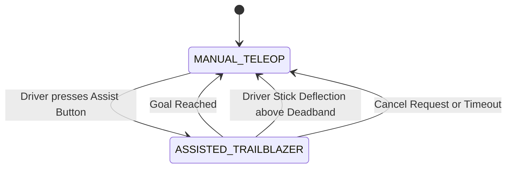
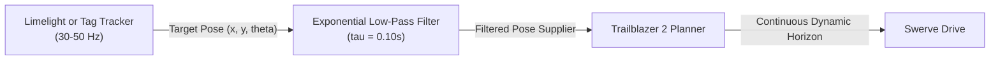

# Trailblazer 2 Design Specification: Teleop Integration & Dynamic Assist

**Document ID:** TB2-SPEC-04  
**Status:** Approved for Implementation  
**Author:** Team 581 Technical Staff  
**Applies To:** `TrailblazerDriveSource`, `TeleopAssist`, `Swerve`, `DriverOverride`  

---

## 1. Overview & Operational Goals

A major architectural strength of Trailblazer has always been its ability to bridge autonomous and teleoperated control through a unified code solution. In Trailblazer 1, teleop utilized Trailblazer for specific behaviors like `CLIMB_ASSIST` in `Swerve.java`, but lacked a first-class, dynamic drive-to-pose API and graceful driver preemption mechanics.

Trailblazer 2 establishes teleoperated assistance as a first-class citizen with four core capabilities:
1. **Instant On-The-Fly Drive-to-Pose:** Driver presses a button to drive to a designated field pose (e.g. Reef branch, Subwoofer, Amp, Trench scoring station) without pre-generating paths.
2. **Dynamic Sensor Target Tracking:** Real-time alignment to camera-detected game pieces or AprilTag visual targets updated at 50 Hz.
3. **Seamless Driver Preemption & Blending:** Instantaneous, jerk-free transition back to open-loop teleop when the driver deflects sticks beyond deadband.
4. **Shared Physical Limits:** Teleop assists respect the exact same measured drivetrain limits, motor curves, and 2D vector acceleration bounds as autonomous routines.

---

## 2. Teleop Assist API

Trailblazer 2 introduces dedicated runtime methods on the `Trailblazer` facade designed specifically for teleop invocation:

```java
public class Trailblazer {
    // 1. Instant single-target drive to pose
    public void driveTo(Pose2d targetPose, LimitsProfile profile);

    // 2. Dynamic tracking with continuous pose supplier (e.g. Limelight / AprilTag)
    public void driveTo(Supplier<Pose2d> targetSupplier, LimitsProfile profile);

    // 3. Multi-waypoint tactical trajectory (e.g. approach via offset, then dock)
    public void driveThrough(List<Pose2d> waypoints, Pose2d finalStop, LimitsProfile profile);

    // 4. Cancel active teleop motion
    public void cancel();
}
```

### 2.1 Single-Goal Horizon Synthesis
When `driveTo(targetPose, profile)` is invoked:
- Trailblazer 2 synthesizes an ephemeral 1-segment, 1-goal plan on the fly.
- Leg 0 latches the robot's current measured pose.
- The target is declared with `pass: stop` and arrival finish tolerances (`finish: {pos: 0.03, heading: 2deg, speed: 0.1}`).
- The two-pass velocity profiler solves the optimal trapezoidal braking profile along the line of sight in $< 20 \; \mu\text{s}$.
- Heading planner computes the optimal shortest-path rotation with a `hard` gate at arrival.

---

## 3. Driver Preemption & Seamless Stick Blending

A critical requirement in competitive FRC is that autonomous assistance must never "trap" or fight the human driver. If the driver senses impending defense or changes their strategy, touching the joystick must instantly restore manual control.



### 3.1 Preemption Detection
`TrailblazerDriveSource` continuously monitors driver joystick magnitudes via `ControllerHelpers`:
```java
public boolean isDriverIntervention() {
    double translationMagnitude = Math.hypot(driverController.getLeftX(), driverController.getLeftY());
    double rotationMagnitude = Math.abs(driverController.getRightX());
    return translationMagnitude > DRIVER_OVERRIDE_THRESHOLD 
        || rotationMagnitude > DRIVER_ROTATION_OVERRIDE_THRESHOLD;
}
```
Default thresholds:
- `DRIVER_OVERRIDE_THRESHOLD = 0.15` (15% stick deflection)
- `DRIVER_ROTATION_OVERRIDE_THRESHOLD = 0.15`

### 3.2 Continuous Velocity Handoff (Eliminating Handoff Jitter)
In naive implementations, canceling an automated drive causes the robot to suddenly brake or jerk because manual teleop starts reading raw stick inputs from zero.

Trailblazer 2 guarantees **$C^0$ velocity continuity across handoffs**:
1. When preemption triggers, `Trailblazer` records the last commanded velocity vector:
   $$\vec{v}_{exit} = \vec{v}_{last\_command}$$
2. The teleop drive source receives $\vec{v}_{exit}$ as the initial state of its manual rate limiter:
   ```java
   teleopDriveSource.seedVelocity(trailblazer.getLastCommand());
   ```
3. Manual drive slew rate limiters blend smoothly from $\vec{v}_{exit}$ to the driver's commanded stick velocity within 100 ms.
4. **Result:** The driver feels seamless, tactile authority with zero mechanical shock or module skid.

---

## 4. Dynamic Vision Target Acquisition

For scoring and intaking game pieces, target poses fluctuate as vision estimation refines:



### 4.1 Vision Pose Filtering
Directly feeding raw vision camera updates can induce high-frequency jitter into path tangent calculations.
Trailblazer 2 wraps dynamic suppliers in a low-pass spatial filter:
$$\mathbf{p}_{target, filtered}(t) = \alpha \mathbf{p}_{target, vision}(t) + (1 - \alpha) \mathbf{p}_{target, filtered}(t - \Delta t)$$
where $\alpha = \frac{\Delta t}{\tau + \Delta t}$ with time constant $\tau = 0.10$ s.

### 4.2 Moving Target Velocity Feedforward
If tracking a moving target (e.g. an autonomous partner or moving game element):
$$\vec{v}_{cmd} = \vec{v}_{profile} \hat{t} + \vec{v}_{target\_feedforward} + \vec{v}_{xt} \hat{n}$$
The vector limiter bounds total acceleration, ensuring tracking remains traction-safe even if the visual target moves abruptly.

---

## 5. Semi-Autonomous Assisted Modes

Trailblazer 2 enables hybrid teleoperated control modes where one degree of freedom is automated while the other remains under driver manual control:

| Assist Mode | Translation Authority | Rotation Authority | Use Case |
| :--- | :--- | :--- | :--- |
| **Full Alignment** | Trailblazer 2 (`driveTo`) | Trailblazer 2 (`hard` gate) | Hands-free docking to Reef, Subwoofer, or Climb |
| **Driver Translation + Auto Aim** | Manual Driver Left Stick | Trailblazer 2 (`facePoint(Hub)`) | Shooting on the fly; driver evades defense while robot aims |
| **Auto Line + Driver Speed** | Trailblazer 2 (latched trench line) | Manual / Fixed Heading | Confined trench transit; driver controls throttle, robot steers |
| **Bump Crossing Assist** | Trailblazer 2 (constant 4 m/s zone) | Trailblazer 2 (`hold` heading) | Safe traverse across terrain without driver pitch/roll bounce |

---

## 6. Teleop Safety Guarantees & Watchdogs

1. **Maximum Execution Timeout:** Any `driveTo` teleop command has an internal timeout (default: $3.0$ seconds). If uncompleted, it automatically cancels to prevent runaway behavior.
2. **Field Keepout Rejection:** If a driver accidentally commands a `driveTo` whose target pose falls inside a defined keepout zone (e.g. opposing alliance stage or illegal field perimeter), Trailblazer rejects the command with an audible driver station alert.
3. **Wheel Lock on Arrival:** Upon successfully completing a `driveTo` (`atGoal() == true`), the swerve subsystem can be configured to command an "X-Stop" module lock to resist defensive nudges.
