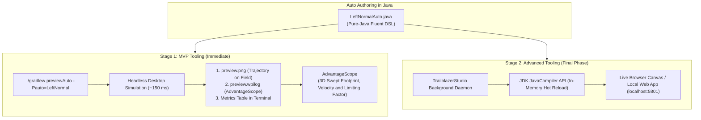
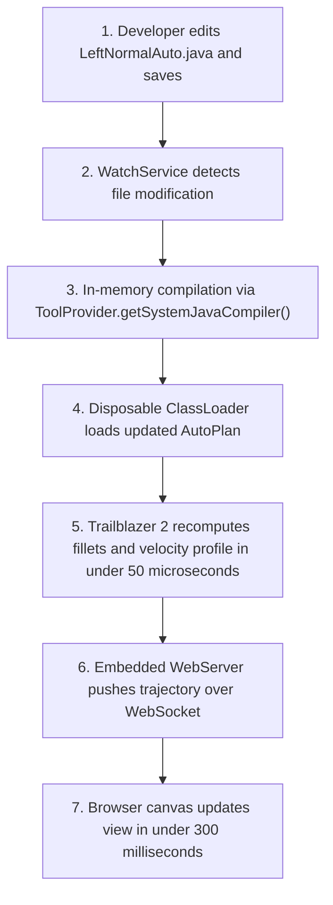

# Trailblazer 2 Design Specification: Java Specification Model, DSL & Tooling

**Document ID:** TB2-SPEC-05  
**Status:** Approved for Implementation  
**Author:** Team 581 Technical Staff  
**Applies To:** `AutoPlan`, `Goal`, `HeadingPlan`, `FieldAnchors`, `AutoPreviewTask`, `TrailblazerLivePreviewer`  

---

## 1. Architectural Pivot: Java-First Specification

Following extensive architectural evaluation, Trailblazer 2 **rejects YAML/JSON as an intermediate specification language** and adopts a **100% Pure-Java Specification Model**.

### 1.1 Why YAML Was Rejected
1. **The "Split-Brain" Problem:** FRC autonomous routines are integrated state machines. In [`LeftNormalAuto.java`](../../../../../../../../comp-bot/src/main/java/frc/robot/autos/auto_state_machines/LeftNormalAuto.java), dynamic lambdas (`() -> getCollisionPoint(...)`), IMU pitch/roll triggers (`StuckOnBallRecovery`), and event markers (`passedMarker(READY_TO_CROSS_BUMP)`) require direct interaction with robot mechanisms. In YAML, dynamic logic must be split across configuration and code registries, breaking cohesion.
2. **Compile-Time Safety & IDE Refactoring:** In Java 21, `javac` and ErrorProne verify every type, symbol, and argument before deployment. Refactoring tools (**Rename Symbol (`Shift+F6`)**, **Find Usages**) update code instantly. In YAML, typos in anchor names or marker strings fail silently until runtime execution on the roboRIO.
3. **No Parser Maintenance Burden:** By writing autos in Java, the team maintains zero YAML parsing, JSON schema, or string-to-object reflection plumbing.

---

## 2. Canonical Java Fluent DSL

Autos are authored using a strongly typed, fluent Java builder API that constructs immutable `AutoPlan` records.

### 2.1 Specification Example: `LeftNormalAuto.java`
```java
public class LeftNormalAuto extends BaseImperativeAuto<NormalAutoState> {

  public enum Markers {
    PRIORITIZE_INTAKE,
    START_SHOOT_RQ,
    READY_TO_CROSS_BUMP
  }

  // Canonical pure-Java auto specification
  private final AutoSegment intakeFirstCycle =
      Trailblazer.plan("intake_first_cycle")
          .withLimits(LimitsProfile.FAST)
          .addGoal(
              Goal.through(FieldAnchors.RED_DEPOT_TRENCH)
                  .within(0.75))
          .addGoal(
              Goal.through(() -> getCollisionPoint(FieldAnchors.BALL_A))
                  .within(0.30)
                  .heading(HeadingPlan.to(115.0).before(1.0).gate(GatePolicy.SOFT))
                  .marker(Markers.PRIORITIZE_INTAKE))
          .addGoal(
              Goal.stop(FieldAnchors.RED_DEPOT_BUMP.plus(0, BUMP_OFFSET))
                  .finish(0.20, Rotation2d.fromDegrees(3), 0.20)
                  .marker(Markers.READY_TO_CROSS_BUMP))
          .build();
}
```

### 2.2 Core Data Model

#### `Goal` Definition
```java
public record Goal(
    Supplier<Pose2d> poseSupplier,       // Absolute, anchor offset, or dynamic supplier
    PassType passType,                   // STOP, THROUGH, or THROUGH_WITH_MIN_SPEED
    double withinMeters,                 // Maximum corner deviation (fillet bound)
    double minPassSpeedMetersPerSec,     // Requested exit speed for THROUGH goals
    FinishTolerance finishTolerance,     // Position, heading, and velocity tolerances for STOP
    Optional<HeadingKeyframe> heading,   // Associated heading schedule keyframe
    Optional<Enum<?>> marker             // Event marker emitted when progress crosses goal
) {}
```

#### `HeadingPlan` Keyframe
```java
public record HeadingKeyframe(
    AnchorDistance anchor,               // atGoal, before(meters), after(meters)
    HeadingTarget target,                // fixed(rot), faceTravel(), facePoint(x,y), hold()
    TurnDirection direction,             // SHORTEST, CW, CCW
    GatePolicy gate,                     // SOFT (unconstrained speed) vs HARD (speed-capped)
    Rotation2d tolerance                // Arrival angular tolerance
) {}
```

---

## 3. Centralized Field Anchor Dictionary (`FieldAnchors.java`)

To eliminate hardcoded floating-point meter constants and coordinate duplication, field geometry is centralized in `shared/src/main/java/com/team581/autos/FieldAnchors.java`:

```java
public final class FieldAnchors {
  // 2026 Reefscape / Offseason Field Geometry (Red Reference Frame)
  public static final Pose2d RED_DEPOT_TRENCH = new Pose2d(10.489, 1.500, Rotation2d.fromDegrees(90));
  public static final Pose2d RED_DEPOT_BUMP   = new Pose2d(13.576, 2.450, Rotation2d.kZero);
  public static final Translation2d HUB_CENTER = new Translation2d(12.100, 4.034);
  public static final Pose2d BALL_A           = new Pose2d(8.744, 2.021, Rotation2d.fromDegrees(115));

  // Algebraic offset helper
  public static Pose2d offset(Pose2d base, double dx, double dy, Rotation2d dTheta) {
    return new Pose2d(base.getX() + dx, base.getY() + dy, base.getRotation().plus(dTheta));
  }

  // Pure mathematical alliance mirror
  public static Pose2d flipToBlue(Pose2d redPose) {
    return FieldUtil.pathflip(redPose);
  }

  private FieldAnchors() {}
}
```

---

## 4. Two-Tier Tooling Architecture

Tooling development is phased into two distinct stages:
1. **MVP Tooling (Immediate Priority):** Headless `./gradlew previewAuto` simulation task integrated with AdvantageScope.
2. **Advanced Tooling (Final Phase):** Standalone In-Memory Live Previewer application (`TrailblazerStudio`).



---

## 5. MVP Tooling: `./gradlew previewAuto`

The MVP tooling provides an end-to-end feedback loop in **$< 2$ seconds** using only existing project infrastructure (Gradle + AdvantageScope + WPILib desktop testing).

### 5.1 CLI Execution
An author runs:
```powershell
./gradlew previewAuto -Pauto=LeftNormal
```

### 5.2 What the MVP Task Executes
1. **Desktop JVM Invocation:** Gradle runs a lightweight Java executable on the laptop (`frc.robot.autos.preview.AutoPreviewRunner`).
2. **Direct Code Instantiation:** The runner instantiates `LeftNormalAuto` directly on the JVM. No parsing is needed because it is already compiled Java bytecode.
3. **Pure Math Solve:** Runs Trailblazer 2's `PathBuilder` and `VelocityProfiler` across all segments. A 15-second auto solves in **$< 5$ milliseconds**.
4. **Closed-Loop Physics Sim:** Simulates 15 seconds of robot motion at 50 Hz against the first-order drivetrain model ($40$ ms lag, motor acceleration curves, carpet friction limits). Total runtime: **$\approx 150$ milliseconds**.
5. **Generates Output Artifacts:**
   - **`build/reports/autos/<name>.wpilog`:** A standard WPILog containing high-frequency odometry, target poses, velocity profiles, and active limiting factors.
   - **`build/reports/autos/<name>.png`:** A high-resolution top-down PNG rendering showing the filleted path overlaid onto the official field diagram.
   - **Terminal Metrics Summary:**
     ```text
     ============================================================
     Trailblazer 2 Auto Preview: LeftNormal
     ============================================================
     Total Execution Duration:  13.42 s (Budget: 15.0 s)  [PASS]
     Peak Linear Speed:         4.68 m/s (Limit: 4.75 m/s)
     Peak Linear Acceleration:  3.92 m/s² (Limit: 4.00 m/s²)
     Peak Lateral Acceleration: 3.45 m/s² (Limit: 3.50 m/s²)
     Min Keepout Clearance:     0.28 m (Keepout: BUMP_ZONE) [PASS]
     Final Stop Error:          0.02 m, 0.8° (Tolerance: 0.2m, 3°) [PASS]
     
     Limiting Factor Breakdown:
       - TOP_SPEED:            42.1%
       - CORNER_CENTRIPETAL:   34.3%
       - GOAL_DECELERATION:    23.6%
     ============================================================
     Log written to: build/reports/autos/left_normal.wpilog
     Plot written to: build/reports/autos/left_normal.png
     ```

### 5.3 AdvantageScope Visual Workflow
Opening `left_normal.wpilog` in AdvantageScope immediately displays:
- **3D Field Tab:** The robot bumper geometry moving along the filleted path.
- **Line Graph Tab:** Commanded velocity vs. measured velocity vs. local speed limits.
- **Diagnostics Band:** Color-coded timeline displaying the active limiting constraint (`LimitingFactor`) at every loop.

---

## 6. Advanced Tooling: In-Memory Live Previewer App (`TrailblazerStudio`)

The standalone previewer application is scheduled as the **final deliverable** of the Trailblazer 2 project. It enables instant visual feedback without running manual Gradle commands.

### 6.1 Architectural Design: In-Memory Hot Reload



### 6.2 Key Components of the Studio Daemon
1. **File Watcher (`java.nio.file.WatchService`):**
   Monitors the `comp-bot/src/main/java/frc/robot/autos/` directory for file modification events.
2. **In-Memory JDK Compiler (`javax.tools.JavaCompiler`):**
   Uses `ToolProvider.getSystemJavaCompiler()` from the host JDK. Compiles solely the modified Java class into memory in $\approx 100$ ms, referencing the existing Gradle classpath.
3. **Disposable Dynamic ClassLoader:**
   Loads the newly compiled class into a dedicated classloader, extracts the `AutoPlan`, and discards the classloader to avoid JVM metaspace memory leaks.
4. **Instant Trajectory Evaluation:**
   Trailblazer 2's `PathBuilder` and `VelocityProfiler` evaluate the new path in $< 50 \; \mu\text{s}$.
5. **Local Web Dashboard (`localhost:5801`):**
   A zero-install, lightweight web interface served via WPILib's built-in `WebServer` (`edu.wpi.first.net.WebServer`):
   - Interactive HTML5 canvas / SVG rendering of the 2D field.
   - Draggable zoom/pan.
   - Real-time display of total duration, corner radii, and clearance warnings.
6. **Total Turnaround Time:** **$< 300$ milliseconds** from pressing `Ctrl+S` to seeing the path update on screen.

### 6.3 Optional Future Extension: Bidirectional AST Sync
If visual dragging of waypoints on the canvas is desired in the future:
- The app uses [JavaParser](https://javaparser.org/) to parse the AST of the `.java` file.
- When a user drags a waypoint on the field canvas, JavaParser updates the exact coordinate literal in the Java source file on disk.
- Spotless auto-formats the file, keeping Java code version-controlled and pristine.

---

## 7. Tooling Comparison Summary

| Feature | MVP: `./gradlew previewAuto` | Final Phase: `TrailblazerStudio` |
| :--- | :--- | :--- |
| **Status** | **Immediate MVP Priority** | **Final Project Phase** |
| **Invocation** | Terminal command: `./gradlew previewAuto -Pauto=...` | Background daemon / auto-run on save |
| **Turnaround Time** | $\approx 2.0$ seconds | $< 300$ milliseconds |
| **Viewer** | AdvantageScope (`.wpilog`) + PNG image | Embedded Browser Canvas (`localhost:5801`) |
| **Dependencies** | Existing GradleRIO + WPILib desktop tasks | JDK `JavaCompiler` + Local WebServer |
| **CI Integration** | Runs directly in GitHub Actions PR checks | Local developer workstation use |
| **Maintenance Cost** | Minimal ($\approx 200$ lines of Gradle/Java runner) | Medium ($\approx 600$ lines of daemon/web UI) |
