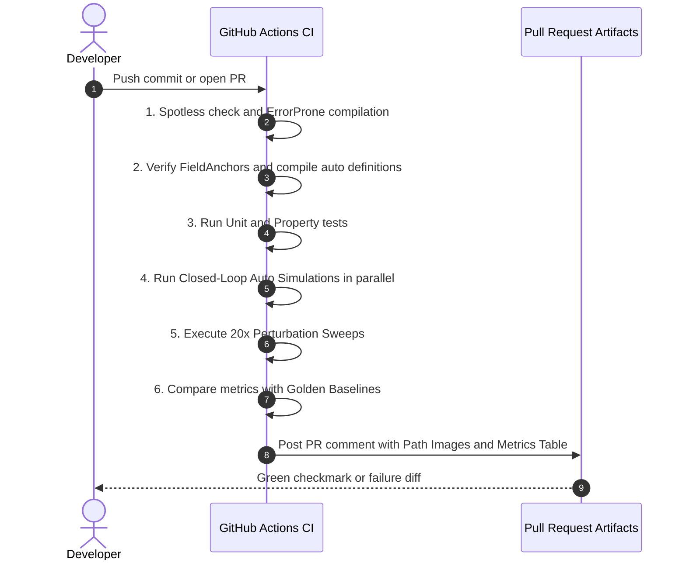

# Trailblazer 2 Design Specification: Verification, Simulation & CI

**Document ID:** TB2-SPEC-06  
**Status:** Approved for Implementation  
**Author:** Team 581 Technical Staff  
**Applies To:** `TimeSource`, `AutoSimulationHarness`, `PerturbationTest`, `LogReplay`  

---

## 1. Overview & Verification Philosophy

In traditional FRC autonomous development, testing occurs primarily on the physical robot during scarce field time. Regressions, corner collisions, and gain instability are often discovered hours before competition matches.

Trailblazer 2 transforms autonomous verification by making motion planning **100% deterministic, headlessly simulatable, and verifiable in CI**. Because the planner is a pure function of state, spec, and limits, any auto can be tested under hundreds of perturbed physical scenarios in seconds before code is ever merged to `main`.

---

## 2. Injected Deterministic Time & State Architecture

In Trailblazer 1, classes like `ConstraintsCalculator` accessed system time and driver station state directly:
```java
// Anti-Pattern in Trailblazer 1:
private double lastTimestamp = MathSharedStore.getTimestamp();
lastCommandedVelocity = DriverStation.isDisabled() ? 0 : linearVelocity;
```
Direct static calls break unit test repeatability and prevent running fast-forward simulations in CI.

### 2.1 Injected Interfaces
Trailblazer 2 injects all environmental dependencies via lightweight interfaces:

```java
@FunctionalInterface
public interface TimeSource {
    double getTimestampSeconds();
}

public interface RobotStateSource {
    Pose2d getMeasuredPose();
    ChassisSpeeds getMeasuredSpeeds();
    boolean isAutonomousEnabled();
}
```

- **On Robot:** `TimeSource` binds to `RobotController.getFPGATime() / 1e6`.
- **In Simulation & CI:** `TimeSource` is driven by a synthetic stepper (`simTime += dt`), allowing a 15-second autonomous routine to execute in under $100$ ms with complete bitwise reproducibility.

---

## 3. The Five-Layer Testing Pyramid

```
                       / \
                      /   \
                     / Log \
                    /Replay \
                   /---------\
                  /Perturbation\
                 /  Sim Sweeps  \
                /----------------\
               / Closed-Loop Sim  \
              /--------------------\
             / Property & Fuzzing   \
            /------------------------\
           /     Fast Unit Tests      \
          /----------------------------\
```

### 3.1 Layer 1: Unit Tests (Execution: < 2 seconds, Every Push)
Verifies mathematical and geometric components in isolation:
- `PathBuilderTest`:
  - Validates fillet deviation formula: $d_{dev} = r (\sec(\theta/2) - 1)$.
  - Verifies tangent length allocation on short adjacent legs ($t_{in} + t_{out} \le L$).
  - Asserts that collinear corners ($\theta < 1.0^\circ$) omit fillets cleanly without division by zero.
  - Asserts that reversal corners ($\theta \ge 150^\circ$) force stop goals ($v_{exit} = 0$).
- `VelocityProfilerTest`:
  - Confirms speed strictly obeys $v \le \sqrt{a_{lat} / \kappa}$.
  - Asserts that a stop goal sample is pinned to $0.0$ m/s and backward braking deceleration obeys $a_{brake}$.
  - Verifies acceleration from rest matches motor torque curve $a_0 (1 - v/v_{free})$.
  - Verifies that velocity chatter is eliminated when simulated measured velocity has noise.
- `HeadingPlannerTest`:
  - Verifies rotation direction disambiguation (`SHORTEST`, `CW`, `CCW`).
  - Asserts that hard gates throttle translational velocity ($v_{cap} = d_{anchor} / t_{rot}$).
- `VectorLimiterTest`:
  - Asserts isotropic 2D acceleration bounds: $\|\vec{v}_{cmd} - \vec{v}_{prev}\| \le a_{fric} \cdot \Delta t$ across all quadrants.
- `ProgressTrackerTest`:
  - Asserts monotonic progress ratcheting ($s_{k+1} \ge s_k$).
  - Verifies re-latch triggering when $|e_{xt}| > e_{relatch}$ or on vision pose steps.

### 3.2 Layer 2: Property & Fuzz Testing (Nightly / Large Sweeps)
Generates thousands of randomized path geometries, start states, and noise levels.  
**Invariants Asserted:**
1. Zero `NaN`, `-NaN`, or `Infinity` output values.
2. Commanded linear velocity never exceeds $v_{max} + 10^{-6}$.
3. Commanded vector acceleration never exceeds $a_{fric} + 10^{-6}$.
4. Every valid goal list reaches completion within a finite step bound.

### 3.3 Layer 3: Closed-Loop Auto Simulation (Every Push & PR)
Executes each full auto routine (`LeftNormal`, `RightNormal`, `LeftSpecial`, `RightSpecial`) against a physics-based swerve drivetrain simulation:
- First-order actuator lag: $\tau_{lag} = 40$ ms.
- Tire friction limit: $a_{fric} = 3.8$ m/s$^2$.
- Motor acceleration falloff.
- Swept 2D bumper collision footprint.

**Per-Auto Automated Assertions:**
- Total segment execution completes within time budget ($t_{actual} \le t_{budget}$).
- Final stop goals arrive within tolerance: $\|\mathbf{p}_{final} - \mathbf{p}_{target}\| \le 0.05$ m, $|\theta_{final} - \theta_{target}| \le 2.0^\circ$.
- Through goals are traversed within declared `within` distance.
- Bumper polygon never intersects declared keepout zones.
- Event markers fire once, and in strict chronological order.

### 3.4 Layer 4: Perturbation & Robustness Testing (Monte Carlo Sweeps)
Real matches introduce unpredictable disturbances. In CI, each auto executes across $N = 20$ randomized perturbation runs with fixed pseudo-random seeds:
- **Initial Pose Offset:** Random translation $\Delta \mathbf{p} \sim \mathcal{U}(-0.08, 0.08)$ m, heading $\Delta \theta \sim \mathcal{U}(-5^\circ, 5^\circ)$.
- **Measurement Noise:** Odometry white noise ($\sigma = 0.015$ m).
- **Vision Correction Step:** Discrete $0.25$ m position jump injected at $t = 3.0$ s.
- **Physical Collision Shove:** $1.5$ m/s lateral velocity impulse for $100$ ms to simulate bumper contact.

**Assertion:** The auto must recover, re-latch cleanly, and reach all stop goals without stalling or flipping.

### 3.5 Layer 5: Log Replay Testing (Nightly & Pre-Competition)
Replays real competition `.wpilog` logs from field matches:
- Feeds logged measured poses and velocities into the Trailblazer 2 planner.
- Compares simulated commands with logged commands.
- Calculates **Model Residual**:
  $$\text{Residual} = \frac{1}{M} \sum_{i=1}^M \|\vec{a}_{achieved, i} - \vec{a}_{commanded, i}\|$$
  A rising model residual alerts the team to mechanical degradation (carpet wear, worn tread, battery sag) before matches begin.

---

## 4. Continuous Integration Pipeline & PR Gates

Every GitHub Pull Request executing changes in `shared` or robot repositories triggers the automated workflow:



### 4.1 Golden Metrics Comparison
Stored in `src/test/resources/baselines/auto-metrics.json`:
```json
{
  "left_normal": {
    "duration_seconds": 13.42,
    "peak_velocity": 4.68,
    "peak_acceleration": 3.92,
    "min_keepout_clearance_meters": 0.28
  }
}
```
If a PR modifies an auto and increases execution duration by $> 0.2$ s or reduces keepout clearance by $> 0.05$ m, CI fails the build unless the author updates the golden baseline file with an explicit justification in the commit message.

---

## 5. Automated PR Comment Format

When CI completes, an automated bot comments directly on the PR with visual verification:

| Auto | Result | Duration | Peak Accel | Min Clearance | Status |
| :--- | :---: | :---: | :---: | :---: | :---: |
| `LeftNormal` | **PASS** | 13.42 s (-0.05s) | 3.92 m/s² | 0.28 m | Green |
| `RightNormal` | **PASS** | 13.38 s (+0.01s) | 3.88 m/s² | 0.31 m | Green |
| `LeftSpecial` | **PASS** | 14.10 s (-0.12s) | 3.95 m/s² | 0.22 m | Green |
| `RightSpecial` | **PASS** | 14.05 s (+0.00s) | 3.91 m/s² | 0.25 m | Green |

*Generated trajectory preview artifacts (`.png` and `.wpilog`) are uploaded as downloadable PR artifacts.*
