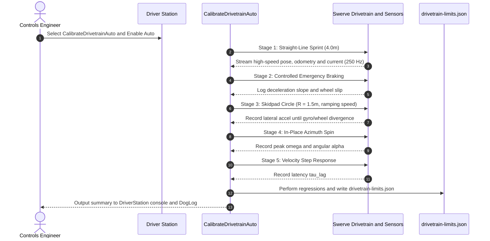

# Trailblazer 2 Design Specification: Empirical Drivetrain Calibration

**Document ID:** TB2-SPEC-07  
**Status:** Approved for Implementation  
**Author:** Team 581 Technical Staff  
**Applies To:** `CalibrateDrivetrainAuto`, `DrivetrainLimits`, `TunerConstants`, `drivetrain-limits.json`  

---

## 1. Overview & Principles

A major source of fragile auto tuning in FRC is embedding assumed physical parameters (e.g. `4.5 m/s` velocity, `8.0 m/s^2` acceleration) directly into individual waypoint definitions. When wheel tread wears down, battery internal resistance rises, or the robot transitions from practice carpet to competition carpet, autos that were tuned on field day fail.

Trailblazer 2 enforces an empirical boundary:
- **Autos declare operational intent and safety margins** (e.g. `limits: fast` $= 0.90 \times \text{limits}$, `limits: careful` $= 0.60 \times \text{limits}$).
- **Physical capabilities belong to the drivetrain**, determined empirically via an automated calibration auto and committed to `drivetrain-limits.json`.

Whenever the chassis undergoes mechanical alterations (new wheels, mass reduction, gear ratio swap), running the calibration routine updates the physical envelope across all autos instantly without editing a single path.

---

## 2. Drivetrain Parameter Identification

The calibration routine identifies eight fundamental physical constants:

| Parameter | Symbol | Units | Physical Meaning | Identification Maneuver |
| :--- | :---: | :---: | :--- | :--- |
| **Top Linear Velocity** | $v_{max}$ | m/s | Maximum achievable steady-state linear speed on carpet | Straight-line sprint at 100% duty cycle |
| **Zero-Speed Acceleration** | $a_0$ | m/s² | Peak stall acceleration from brushless motor torque | Linear regression y-intercept of $a(v)$ vs $v$ |
| **Motor Free Speed** | $v_{free}$ | m/s | Theoretical motor no-load velocity | Linear regression x-intercept of $a(v)$ vs $v$ |
| **Braking Deceleration** | $a_{brake}$ | m/s² | Maximum deceleration achievable without wheel lockup | High-speed hard stop from 4.0 m/s |
| **Friction / Traction Limit** | $a_{fric}$ | m/s² | Peak isotropic carpet traction ($\mu \cdot g$) | Skidpad circle test at increasing speed |
| **Lateral Acceleration Limit** | $a_{lat}$ | m/s² | Safe cornering acceleration before lateral drift | Cornering slip boundary ($a_{lat} \approx 0.90 \cdot a_{fric}$) |
| **Max Angular Velocity** | $\omega_{max}$ | rad/s | Maximum steady-state rotation rate in place | In-place spin test at full rotational voltage |
| **Max Angular Acceleration** | $\alpha_{max}$ | rad/s² | Peak angular acceleration from rest | Spin step response inflection slope |
| **Drivetrain Response Lag** | $\tau_{lag}$ | s | First-order velocity tracking latency | 63.2% rise time of velocity step response |

---

## 3. The Automated Calibration Routine (`CalibrateDrivetrainAuto`)

The calibration sequence executes as an automated, self-contained autonomous routine selectable via the standard `AutoChooser`. It requires an open $5.0 \times 3.0$ meter carpet area.



### 3.1 Stage 1 & 2: Straight-Line Sprint & Braking Test
1. Robot accelerates forward along the field $X$-axis under closed-loop velocity commands requesting $6.0$ m/s for $3.5$ meters.
2. Odometry velocity $v(t)$ and acceleration $a(t) = \frac{\Delta v}{\Delta t}$ are logged at 50 Hz.
3. At $x = 3.5$ m, the robot commands immediate $v = 0$ with active motor braking (brake mode / neutral reverse voltage).
4. **Mathematical Extraction:**
   - $v_{max}$ is taken as the 99th percentile velocity reached during cruise.
   - For points during the acceleration phase ($v < 0.9 v_{max}$), a linear least-squares regression is fit:
     $$a(v) = a_0 - m \cdot v$$
     $$v_{free} = \frac{a_0}{m}$$
   - $a_{brake}$ is taken as the median deceleration during the braking transition:
     $$a_{brake} = \left| \frac{\Delta v}{\Delta t} \right|_{decel}$$

### 3.2 Stage 3: Skidpad Circle Test (Measuring Carpet Traction $a_{fric}$)
Traction coefficient $\mu$ depends heavily on carpet pile direction, tread type (Billet vs 3D-printed vs TPU), and robot mass.
1. Robot drives in a circle of radius $R = 1.50$ m.
2. Speed ramps gradually from $1.0$ m/s upward by $0.2$ m/s per revolution.
3. During cornering, lateral centripetal acceleration is $a_{lat} = \frac{v^2}{R}$.
4. **Slip Detection:** Wheel encoder odometry velocity is compared against high-frequency IMU lateral acceleration and AprilTag visual pose estimation.
5. When wheel slip occurs (wheel speed diverges from IMU integrating track by $> 10\%$), the lateral acceleration value immediately preceding slip is captured as the empirical traction ceiling:
   $$a_{fric} = a_{lat, slip}$$
   $$a_{lat, operational} = 0.90 \cdot a_{fric}$$

### 3.3 Stage 4: In-Place Spin Test (Rotational Limits)
1. Robot spins in place around its physical center from rest to maximum angular rate for $1.5$ seconds, then halts.
2. Gyro yaw velocity $\omega(t)$ and angular acceleration $\alpha(t) = \dot{\omega}$ are captured.
3. $\omega_{max}$ is the peak steady-state rotation rate (typically $12.0$ to $16.0$ rad/s).
4. $\alpha_{max}$ is the peak slope during the step onset (typically $40.0$ to $60.0$ rad/s$^2$).

### 3.4 Stage 5: Step Response Latency ($\tau_{lag}$)
1. Robot executes small velocity steps ($0 \to 1.5$ m/s, $1.5 \to 0$ m/s).
2. The response is modeled as a first-order lag:
   $$v(t) = v_{step} \left(1 - e^{-t / \tau_{lag}}\right)$$
3. $\tau_{lag}$ is measured as the time required to reach $63.2\%$ of the commanded velocity step (nominally $0.035$ to $0.045$ s).

---

## 4. Output Specification: `drivetrain-limits.json`

Upon successful completion of the calibration auto, the robot writes the measured parameters directly to `src/main/deploy/drivetrain-limits.json` (or logs them to USB/NetworkTables for committing):

```json
{
  "schema_version": 2,
  "robot": "comp-bot",
  "calibration_timestamp": "2026-10-07T16:30:00Z",
  "carpet_condition": "competition_field_official",
  "limits": {
    "max_linear_velocity": 4.75,
    "free_linear_acceleration": 8.20,
    "motor_free_speed": 5.10,
    "max_braking_deceleration": 4.10,
    "friction_limit": 3.85,
    "max_lateral_acceleration": 3.45,
    "max_angular_velocity": 14.50,
    "max_angular_acceleration": 52.00,
    "drive_response_lag_seconds": 0.040,
    "cross_track_time_constant": 0.250,
    "max_cross_track_correction": 1.200
  }
}
```

### 4.1 Git Version Control & CI Replay Gate
Whenever `drivetrain-limits.json` is committed, GitHub Actions CI automatically replays the entire suite of competition autos against the new limits in simulation:
- Asserts that all autos still complete within their 15.0-second match budgets.
- Asserts that stop tolerances and keepouts remain satisfied.
- Highlights any auto segments that slowed down due to lower measured traction.

---

## 5. Pre-Competition Calibration Checklist

Before attending a regional or championship event:
1. **Fresh Tread Calibration:** Install fresh competition wheels, run `CalibrateDrivetrainAuto` on the practice field, and commit `drivetrain-limits.json`.
2. **Reference Auto Verification:** Execute three benchmark autos (`LeftNormal`, `RightNormal`, `IntegrationTest`).
3. **Limiting-Factor Review:** Inspect DogLog telemetry in AdvantageScope to ensure no unexpected binds or premature decelerations occur.
4. **Alliance Mirroring Sanity:** Execute one test run on the Red alliance and one on the Blue alliance to verify mirror equivalence.
