# Trailblazer 2 Design Specification: Implementation Roadmap & Migration

**Document ID:** TB2-SPEC-08  
**Status:** Approved for Implementation  
**Author:** Team 581 Technical Staff  
**Applies To:** Full Project Rollout, CI Gates, Tooling Phasing, Deprecation Strategy  

---

## 1. Migration Strategy: Zero Breaking Changes

A primary requirement of the Trailblazer 2 rollout is that the robot software repository must remain **compilable, testable, and match-ready** at every intermediate commit. A wholesale rewrite that breaks existing autos ([`LeftNormalAuto`](../../../../../../../../comp-bot/src/main/java/frc/robot/autos/auto_state_machines/LeftNormalAuto.java), [`RightNormalAuto`](../../../../../../../../comp-bot/src/main/java/frc/robot/autos/auto_state_machines/RightNormalAuto.java), [`IntegrationTest`](../../../../../../../../comp-bot/src/main/java/frc/robot/autos/auto_state_machines/IntegrationTest.java)) is unacceptable during active offseason testing.

To achieve this, the migration uses an **In-Place Adapter Architecture**:
1. The public `Trailblazer` facade retains its current signature (`setActiveSegment`, `getFieldRelativeSetpoint`, `atGoal`, `passedMarker`).
2. Legacy classes (`PidPathFollower`, `HeuristicPathTracker`, `ConstraintsCalculator`) are incrementally replaced behind existing interface boundaries.
3. Legacy `AutoPoint` instances map seamlessly to modern `Goal` definitions via an automatic adapter during Phase 3.
4. Auto specifications remain **100% in pure Java**, with `./gradlew previewAuto` serving as the immediate MVP tooling, and the standalone live previewer app developed as the final phase.

---

## 2. Five-Phase Roadmap and Validation Gates

```mermaid
flowchart LR
    P1["Phase 1: Instrumentation<br/>- Inject TimeSource<br/>- Limiting factor logging<br/>- Headless sim harness"] -->|"Gate 1: Sim matches logged autos"| P2["Phase 2: Limits and Limiter<br/>- DrivetrainLimits record<br/>- Isotropic 2D VectorLimiter<br/>- Symmetric accel/brake"]
    P2 -->|"Gate 2: Symmetric logs, no scrub"| P3["Phase 3: Core Planner<br/>- PathBuilder fillets<br/>- ProgressTracker s<br/>- VelocityProfiler 2-pass<br/>- HeadingPlanner gates"]
    P3 -->|"Gate 3: CI sim green and robot field run"| P4["Phase 4: Java DSL and MVP Tooling<br/>- Java Fluent DSL<br/>- FieldAnchors.java<br/>- Alliance mirroring<br/>- MVP gradlew previewAuto"]
    P4 -->|"Gate 4: New auto previewed and run"| P5["Phase 5: CI Depth and Final App<br/>- Perturbation sweeps<br/>- CalibrateDrivetrainAuto<br/>- Delete legacy classes<br/>- In-Memory Live Preview App"]
    P5 -->|"Gate 5: Clean codebase, green CI"| Done["Trailblazer 2 Operational"]
```

---

### Phase 1: Instrumentation & Baseline Harness
**Focus:** Make existing code deterministic and measurable before making algorithmic changes.

1. Create `TimeSource` and `RobotStateSource` interfaces in `com.team581.time` / `com.team581.state`.
2. Refactor `ConstraintsCalculator` and `Swerve` to ingest `TimeSource`, eliminating direct static calls to `MathSharedStore.getTimestamp()` and `DriverStation.isDisabled()`.
3. Instrument `PidPathFollower` with high-resolution DogLog telemetry logging commanded acceleration and current limiting factors.
4. Construct the headless simulation harness (`SimulatedDrivetrainModel`) capable of stepping physics in fast-forward.
5. Record golden baselines for current autos (`LeftNormal`, `RightNormal`, `IntegrationTest`).

> **Validation Gate 1:** The headless simulation harness runs all current competition autos and reproduces logged physical match trajectories within $\le 5\%$ temporal and spatial error.

---

### Phase 2: Drivetrain Limits & Slew Vector Limiter
**Focus:** Fix the asymmetric acceleration flaw and directional snapping without changing path geometry.

1. Create immutable `DrivetrainLimits` record and JSON loader (`drivetrain-limits.json`).
2. Implement isotropic 2D `VectorLimiter`:
   $$\|\vec{v}_{cmd} - \vec{v}_{prev}\| \le a_{fric} \cdot \Delta t$$
3. Replace the asymmetric 1D slew rate limiter in `ConstraintsCalculator` with the 2D `VectorLimiter`.
4. Calibrate initial limits ($a_{fric} = 3.8$ m/s$^2$, $a_{brake} = 4.0$ m/s$^2$, $v_{max} = 4.75$ m/s) in `drivetrain-limits.json`.

> **Validation Gate 2:** Match telemetry and simulation logs confirm that acceleration and braking are strictly symmetric, module scrubbing on waypoint transitions is eliminated, and existing autos pass without hitting current limits.

---

### Phase 3: Core Planner & Spatial Profiler
**Focus:** Replace heuristic tracking and distance-PID velocity shaping with the online spatial planner.

1. Implement `PathBuilder`:
   - Circular fillet generation using $r \le \delta / (\sec(\theta/2) - 1)$.
   - Collinear bypass ($\theta < 1.0^\circ$) and reversal detection ($\theta \ge 150^\circ \implies \text{forced stop}$).
   - Horizon construction bounded by braking distance $\frac{v_{max}^2}{2 a_{brake}}$.
2. Implement `ProgressTracker`:
   - Spatial projection along arc length $s$.
   - Monotonic ratcheting and cross-track error $e_{xt}$.
   - Leg latching and re-latching on $|e_{xt}| > e_{relatch}$ or vision pose steps.
3. Implement `VelocityProfiler`:
   - Two-pass backward/forward dynamic programming profiler along $s$.
   - Lateral centripetal acceleration capping: $v \le \sqrt{a_{lat} / \kappa}$.
   - Friction circle tangential budget allocation.
4. Implement `HeadingPlanner`:
   - Keyframe target evaluation ($\theta^*(s)$).
   - Hard gate speed capping: $v_{cap} = d_{anchor} / t_{rot}$.
5. Implement `TrailblazerLegacyAdapter` allowing existing `AutoPoint` segment lists to be evaluated by the new planner.

> **Validation Gate 3:** All existing competition autos pass 100% of assertion checks in CI simulation using the new planner, and `LeftNormalAuto` executes successfully on the physical robot.

---

### Phase 4: Java Fluent DSL & MVP Tooling (`./gradlew previewAuto`)
**Focus:** Upgrade authoring ergonomics and deliver the fast local preview tool.

1. Implement canonical Java Fluent DSL (`Trailblazer.plan("...")`, `Goal`, `HeadingPlan`).
2. Create centralized `FieldAnchors.java` dictionary, eliminating hardcoded meter literals.
3. Implement native alliance mirroring utilities (`FieldAnchors.flipToBlue()`, `plan.mirror()`).
4. **Build MVP Tooling: `./gradlew previewAuto -Pauto=<name>`**:
   - Executes auto simulation headlessly on desktop JVM in $< 200$ ms.
   - Generates `build/reports/autos/<name>.wpilog` for instant visualization in AdvantageScope (3D robot swept footprint, filleted path, velocity graphs, limiting factor stream).
   - Generates `build/reports/autos/<name>.png` static trajectory map.
   - Outputs metrics summary table directly to terminal.
5. Re-author `LeftNormalAuto` using the new Fluent DSL and `FieldAnchors`.

> **Validation Gate 4:** A controls student or mentor who did not write the planner successfully authors, previews via `./gradlew previewAuto`, and runs a brand-new auto routine on the robot using the Java DSL workflow.

---

### Phase 5: CI Hardening, Calibration Auto, Deprecation & Final App
**Focus:** Deepen test automation, provide automated robot calibration, delete legacy code, and deliver the live previewer app.

1. Implement 20x Monte Carlo perturbation sweeps in CI (start offsets, vision noise, collision shoves).
2. Implement `CalibrateDrivetrainAuto` on the robot to automate empirical parameter identification.
3. Migrate all remaining competition autos (`LeftSpecial`, `RightSpecial`, `DoNothing`, `TestAuto`) to the new Fluent DSL.
4. Safely delete legacy classes:
   - `com.team581.trailblazer.followers.PidPathFollower`
   - `com.team581.trailblazer.trackers.HeuristicPathTracker`
   - `com.team581.trailblazer.ConstraintsCalculator`
   - Legacy `LinearConstraintOptions` and `AngularConstraintOptions`
5. **Build Advanced Tooling: Standalone In-Memory Live Previewer App (`TrailblazerStudio`)**:
   - Background file watcher monitoring `autos/*.java`.
   - In-memory hot reload via JDK `JavaCompiler` API (`ToolProvider.getSystemJavaCompiler()`) and dynamic ClassLoader.
   - Sub-300 ms live updates on `Ctrl+S` pushed over WebSockets to a local browser canvas (`localhost:5801`).

> **Validation Gate 5:** All legacy classes are deleted, project compiles cleanly, all unit and perturbation tests pass, nightly CI runs 100% green, and the live previewer app provides sub-300 ms updates on save.

---

## 3. Resolution of Open Architectural Questions

| Decision | Final Architecture Choice | Rationale |
| :--- | :--- | :--- |
| **Specification Format** | **100% Pure Java Fluent DSL** | Eliminates YAML "split-brain" dilemma; guarantees compile-time safety, seamless lambdas/suppliers, and instant IDE refactoring. |
| **In-place vs. Clean-room** | **In-place evolution via adapters** | Allows running existing competition autos (`LeftNormal`, etc.) as immediate regression tests during every phase. |
| **Tooling Phasing** | **`./gradlew previewAuto` (MVP) → Live App (Final)** | Delivers high-value AdvantageScope previewing immediately without blocking core planner rollout; reserves dedicated GUI app for the final polish. |
| **Swerve Module Limits** | **Swerve Setpoint Generator downstream** | Trailblazer bounds chassis 2D acceleration; CTRE / WPILib swerve setpoint generator handles individual module steer rate and wheel slip downstream. |
| **Localization Noise Threshold** | **$e_{relatch} = 0.40$ m, $\Delta p_{vision} = 0.25$ m** | Derived from comp-bot odometry logs; absorbs camera latency without triggering unnecessary re-latches. |
| **Heading Gate Defaults** | **Shooting/Docking = `HARD`; Transit/Intake = `SOFT`** | Guarantees scoring shots are never fired off-angle, while preventing pauses during field transit. |
| **Reference Autos** | **`LeftNormal`, `RightNormal`, `IntegrationTest`** | Form the golden baseline test suite across all CI verification tasks. |

---

## 4. Risk Analysis and Technical Mitigations

| Risk | Severity | Root Cause | Technical Mitigation |
| :--- | :---: | :--- | :--- |
| **Fillet cuts into field obstacle** | High | Large `within` tolerance allows wide corner cut | Fillet deviation is strictly bounded: $d_{dev} \le \delta$. CI keepout checks fail builds if swept robot footprint breaches keepouts. Preview PNG highlights clearance. |
| **Velocity chatter from noisy odometry** | High | Velocity feedback cycling through forward profile pass | Forward profiler seeds from last commanded velocity $v_{prev}$ rather than raw measured velocity, unless divergence exceeds $0.75$ m/s. |
| **Simulation passes, robot drifts on carpet** | Medium | Inaccurate friction or latency assumptions | Automated `CalibrateDrivetrainAuto` measures real carpet limits. Log replay tracks model residuals. On-robot pre-event checklist maintained. |
| **RoboRIO loop time overrun** | Medium | Heavy dynamic programming or memory allocations | All profile buffers preallocated (`double[]`). Solve time benchmarked at $< 35 \; \mu\text{s}$ ($0.18\%$ of loop budget). |
| **Dynamic vision targets cause path jitter** | Medium | Camera pose fluctuation at 50 Hz | Exponential low-pass filter ($\tau = 0.10$ s) on dynamic goal suppliers, bounded by the 2D vector limiter. |
| **Driver fights auto assist in teleop** | High | Inability to preempt autonomous assist cleanly | Automatic preemption when stick deflection $> 0.15$; continuous velocity handoff prevents mechanical jerking. |
