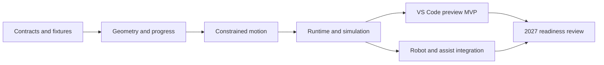

# 08 — Implementation Roadmap and Migration

**Scope:** Build order, deliverables, and acceptance evidence

## 1. Objective

Build a tested TB2 library for the 2027 codebase, with occasional comp-bot carpet validation. Competition-readiness and old-auto compatibility are not required.

Use TB2’s own namespace and the math/runtime separation in [architecture overview](README.md). Do not retrofit TB1, build legacy adapters, or migrate old autos to establish correctness.

Referenced legacy code may remain; deletion is dependency cleanup, not a milestone. Keep the repository compiling and normal driving intact.

## 2. Requirement ownership

This roadmap orders work; the linked specs own formulas, constants, localization thresholds, and tooling requirements.

| Concern | Authoritative document |
| --- | --- |
| Packages and robot boundary | [Architecture overview](README.md) |
| Geometry, progress, recovery | [01: Geometry](01-path-geometry-and-kinematics.md) |
| Speed profile and command bounds | [02: Velocity and limits](02-velocity-profiler-and-limits.md) |
| Heading schedule and readiness gates | [03: Heading](03-heading-and-rotation.md) |
| Runtime state, tick contracts, lifecycle, teleop, dynamic targets | [04: Runtime and integration](04-runtime-integration-and-teleop-assist.md) |
| Java model, field transforms, VS Code preview | [05: Developer tooling](05-developer-tooling.md) |
| Fixtures, simulation, CI, acceptance measurements | [06: Verification](06-verification-simulation-and-ci.md) |
| Robot parameters and calibration | [07: Calibration](07-empirical-calibration-routine.md) |

## 3. Implementation order

Each step delivers code and tests, with CI from step 1. Desktop implementation needs no hardware; robot readiness requires hardware qualification.

```mermaid
flowchart LR
    A[Contracts and fixtures] --> B[Geometry and progress]
    B --> C[Constrained motion]
    C --> D[Runtime and simulation]
    D --> E[VS Code preview MVP]
    D --> F[Robot and assist integration]
    E --> G[2027 readiness review]
    F --> G
```

### Step 1 — Establish contracts and a desktop entry point

Deliver:

- `model` values for plans, goals, heading intent, limits, tick input/output, statuses, and stable event IDs. Use the minimal fluent builder in [05](05-developer-tooling.md); define public intent before algorithms.
- Validation for invalid numbers, identities, terminal behavior, and unresolved target/heading references.
- A Java fixture catalog with an initial straight stop and turn-in-place case. Construct plans without `Robot`, HAL devices, or mechanisms.
- Unit-test wiring in `shared` and a desktop scenario runner skeleton, using existing Gradle/JUnit conventions; establish build/check commands before more modules.

Done when the example plans compile, invalid plans produce useful diagnostics, and the catalog loads on desktop without hardware side effects.

### Step 2 — Implement geometry and progress calculators

Deliver line/arc primitives, coupled fillet construction, exact path samples, goal anchors, local projection, and explicit next-progress calculations per [01](01-path-geometry-and-kinematics.md). Cover static paths through the next stop before optimizing storage; handle duplicate points and exact reversals explicitly.

Done when geometric/property tests cover adjacent short corners, zero-length geometry, figure-8 crossings, through-goal passage, and geometry-generation changes. A rebuild must preserve goal/event identity without comparing distances from different geometries.

### Step 3 — Implement constrained translation and heading math

Deliver the backward/forward profile, bounded heading reference step, heading readiness barriers, terminal pose convergence, and final combined command allocation per [02](02-velocity-profiler-and-limits.md) and [03](03-heading-and-rotation.md). Keep recovery and gate decisions outside generic geometry calculations.

Implement conservative interval checks before optimizing. Report infeasible measured states or tightened envelopes; clamping simulated initial velocity does not establish feasibility.

Done when tests cover startup, braking inside corners, missed/overshot gates, angle wrapping and directed turns, shrinking translation budgets during rotation, and the final command after cross-track/target feedforward is added. Check output independently of its implementation.

### Step 4 — Assemble the runtime and closed-loop evidence

Deliver plan activation/update/cancel/release, input snapshots, dynamic-target state, event history, cached output, and timeout/fault behavior. Connect calculators through this runtime and run it against the desktop plant.

Add the complete representative fixture suite and seeded disturbances in [06](06-verification-simulation-and-ci.md). Produce versioned preview results, traces, diagnostics, and CI summaries from one execution; support replay without treating it as closed-loop validation.

Done when valid scenarios complete, invalid/unreachable scenarios produce their expected failure status, markers behave correctly through relatches, and repeat runs with the same inputs reproduce results within documented numerical tolerances.

### Step 5 — Deliver the VS Code preview MVP

Implement the extension/runner contract in [05](05-developer-tooling.md): select a Java scenario, invoke the normal build/runner, and display geometry, footprint playback, headings, limits, events, and diagnostics. Refresh on save/command and distinguish failed builds from current results.

Done when a student can edit a Java plan, see it run in VS Code, locate a failed constraint, and reproduce the same result with the headless CI command. Test compile errors, cancellation, stale results, and robot/alliance selection; measure cold/warm refresh times.

### Step 6 — Integrate the robot and teleop assist

Add a TB2 drive source and explicit test-mode selection to the deployed robot project. Feed coherent measurements, honor control ownership, log requested/applied motion, and support cancellation without redirecting normal driving.

- Test straight stops, rounded/consecutive corners, heading gates, and displaced-start recovery.
- Derive and validate robot limits using [07](07-empirical-calibration-routine.md).
- Add full alignment to a fixed pose and rotation snaps to a fixed heading per [04](04-runtime-integration-and-teleop-assist.md). Verify driver translation during snaps, per-operation cancellation, completion/timeout, and continuous handoffs to and from manual driving.

Done when desktop integration tests verify mode transitions and hardware sessions demonstrate the core cases with recorded traces. Record untested cases as readiness limits; tooling/math work may continue.

### Step 7 — Review 2027 portability and completion

Deliver an integration example and checklist supplying robot limits/module locations, localization snapshot, field context, drive output, telemetry, and scenario fixtures. Build with a second synthetic robot configuration to expose hardcoded 2026 assumptions.

Done when:

- Shared math/runtime imports no season-specific robot, field, or mechanism code.
- Unit, property, closed-loop, perturbation, and preview integration checks pass under [06](06-verification-simulation-and-ci.md).
- The VS Code workflow and command-line runner consume the same Java plans and diagnostics.
- Robot validation evidence and remaining limitations are recorded, with performance measured on the target hardware.
- The 2027 integration checklist is sufficient to bind the library without altering planner math.

Old-auto parity, TB1 deletion, localization tuning, and unrelated applications are not completion criteria. No commit, push, deployment, or shared-service change is authorized by this implementation plan itself.
