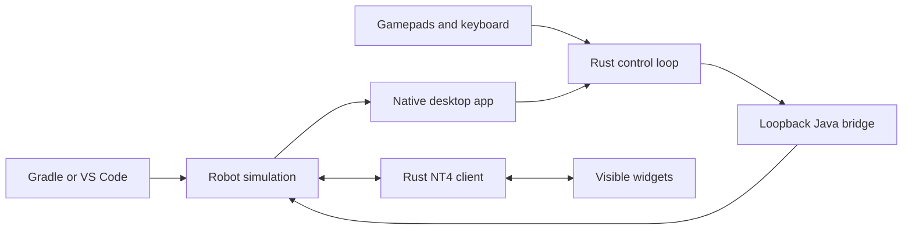

# Simulation Studio

A local simulation Driver Station and generic NetworkTables workspace. Tauri uses the system webview; the app ships no Chromium or Node runtime. Native input and simulation control have dedicated threads independent of NT telemetry and React rendering.



## Run

Install Node **22 LTS or 24+**, Rust using [rustup](https://rustup.rs), and the [Tauri platform prerequisites](https://v2.tauri.app/start/prerequisites/). Simulation builds also find Rust in rustup's default `~/.cargo/bin` location (or `CARGO_HOME/bin`), even if an existing terminal or editor has an older PATH. Restart the terminal and VS Code after installing Rust to use Cargo directly. macOS needs Xcode Command Line Tools; Windows needs MSVC Build Tools and WebView2; Linux needs WebKitGTK 4.1 and libudev development packages.

From the repository root:

```sh
./gradlew offseason-bot:simulateJava
```

The first launch installs locked npm dependencies and builds a release executable. Later launches reuse the executable unless sources or dependencies changed. VS Code's **WPILib: Simulate Robot Code** uses the same environment through `simulateExternalJava*` metadata. All three robot projects integrate the app through `gradle/simulation-app.gradle` and `Base581Robot`.

Original simulator fallback:

```sh
./gradlew offseason-bot:simulateJava -PwpilibSimGui=true
```

For VS Code fallback, regenerate simulation metadata with that property before launching. The property removes the custom bridge environment and restores the original HAL extension choices.

Standalone launch after building:

```sh
sim-app/src-tauri/target/release/simulation-studio \
  --control ws://127.0.0.1:5811 \
  --nt ws://127.0.0.1:5810/nt/simulation-studio \
  --project offseason-bot
```

On macOS, launch the app bundle through Launch Services instead of invoking its executable directly:

```sh
open -n -a "$PWD/sim-app/src-tauri/target/release/bundle/macos/Simulation Studio.app" --args --project offseason-bot
```

On Windows the executable has an `.exe` suffix. Only loopback WebSocket endpoints are accepted. One app connection controls a simulation at a time. A new simulation launch reuses the existing app window and loads that project's workspace. Do not run multiple robot simulations on the default ports at once.

For a native installer/bundle, run `npm run tauri -- build --bundles app` on macOS, or select the Tauri bundle targets appropriate to Windows/Linux. Gradle builds and launches the macOS app bundle; Windows and Linux use the standalone executable. For development, `npm run desktop` runs the Vite development server; ordinary simulation launches use embedded assets.

## Use

- Enable/Disable, Auto, Teleop, Test, Full Match, alliance, state, elapsed time, and E-stop are in the left control column. Select Full Match, edit its 20 second Auto, 3 second disabled transition, and 140 second Teleop durations, then press Enable to start. Mode/alliance changes cancel a running sequence. E-stop stays latched until the simulation restarts. Losing focus in the main window disables simulation and automatically switches to compact mode; subsequent focus loss in compact mode keeps simulation enabled and clears keyboard keys. The robot watchdog still disables after 250 ms without valid frames.
- **Controllers** is a permanent tab. Assign physical gamepads independently from the active keyboard port. The keyboard can contribute to the same port as a physical gamepad; buttons merge, and held keyboard axis/D-pad directions take priority. Switching keyboard ports clears held keys without interrupting the gamepad. Click a controller control to capture its next key; Escape cancels, and Clear removes a binding. Port reassignment and unplugging disable simulation. Device assignments are never silently replaced.
- Click/drag any NT entry to add a widget. Open a folder and choose **Open all entries in folder** to create independent widgets recursively. Choosers are grouped; duplicates are skipped. Run it again to add newly published entries. No folder has special feature-flag or tuning behavior.
- Move/resize widgets and organize them in named tabs. Double-click a tab to rename it; each tab has a close button, and at least one workspace tab remains. Supported editable widgets, including choosers and tunables, publish immediately by default. Readout and details widgets stay display-only. A slider requires an explicit range; a custom selector requires explicit typed options.
- Click away from Studio to automatically turn the same app window into an always-on-top overlay, or use **Settings → Open compact overlay**. Use the overlay’s expand button to restore the full window. It starts at 320 × 180 logical pixels, can be resized and moved, and remembers its bounds per workspace. Enable/Disable, mode selection, current state/time, and keyboard port switching are available by default; alliance and E-stop are optional overlay controls. Choose overlay controls and select and order workspace topics in **Settings**, which also contains the project and connection endpoints. Compact mode requires window focus for keyboard input but keeps simulation and physical controllers active when focus moves elsewhere.
- NT integers use decimal strings throughout IPC to preserve signed 64-bit precision. Integer array editors require quoted JSON values, e.g. `["9007199254740993"]`. Raw/structured formats are read-only; value previews have a shared 4 KiB budget and at most 100 array elements. Full cached details are fetched only on request.
- Standard `SendableChooser` widgets display `options`, publish `selected` (including when the robot has not published that setter topic), and display robot-reported `active` separately. The app discovers `.type` metadata at any path.
- NT does not promise robot acknowledgement of a write. Widgets distinguish locally published values from received values; robot publication can overwrite the local edit. Disconnected writes are rejected and never replayed.
- Layouts, input profiles, keyboard destination, match durations, Topics visibility, and compact overlay settings save per project in the operating system's application-data directory for `org.team581.simulation-studio`. Version 1 workspaces migrate on load. Values, enable state, held keys, and a running match are never restored from a workspace.

## Add a widget type

Add a definition to `src/widgets.tsx`'s registry and its identifier to `WidgetKind`. Each definition supplies compatibility, default settings, a settings component, and a renderer. Renderers use the shared `useTopic`, `useDescriptor`, and `useSubscriptions` hooks and the typed `write_topic` command. Keep network connections out of widgets; one shared subscription serves every consumer of a topic. Add workspace validation/migration support when changing persisted configuration. Runtime third-party plugins are outside v1.

## Check

```sh
cd sim-app
npm ci
npm run check
```

The root bridge integration tests use real HAL and WebSockets:

```sh
./gradlew shared:test --tests 'com.team581.simulation.*Test' -PwpilibSimGui=true
```

For a real NT4/HAL fixture without CAN hardware:

```sh
./gradlew shared:simulationAppFixture -PfixtureTopics=10000 -PwpilibSimGui=true
```

Launch the app separately with `--project fixture`. The fixture announces 10,000 numeric topics and updates the first 500 at approximately 50 Hz. Its values folder supports large bulk-open tests. Use Ctrl+C to stop it. `simulation-app.yml` builds/checks the app on all three platforms; native UI and physical-device smoke tests still require the respective environments.

See [PERFORMANCE.md](PERFORMANCE.md) for measurements and remaining validation.
